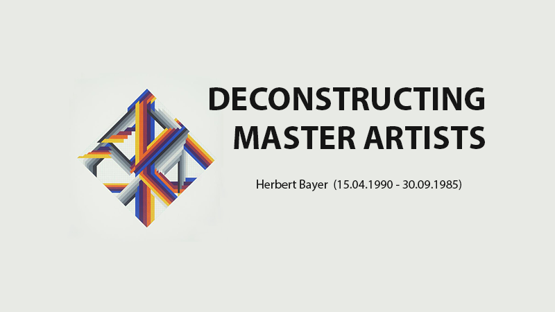
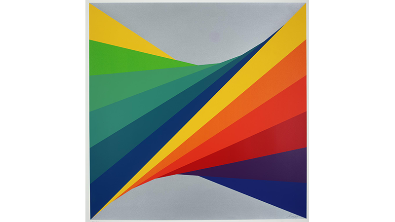
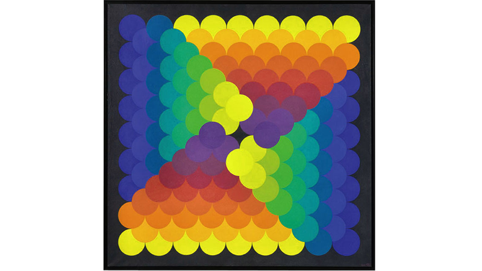
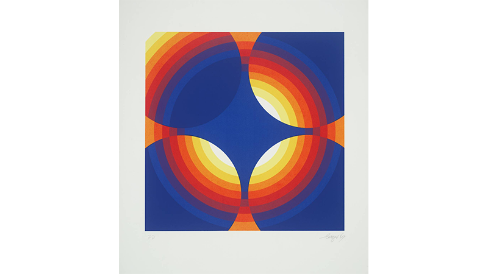
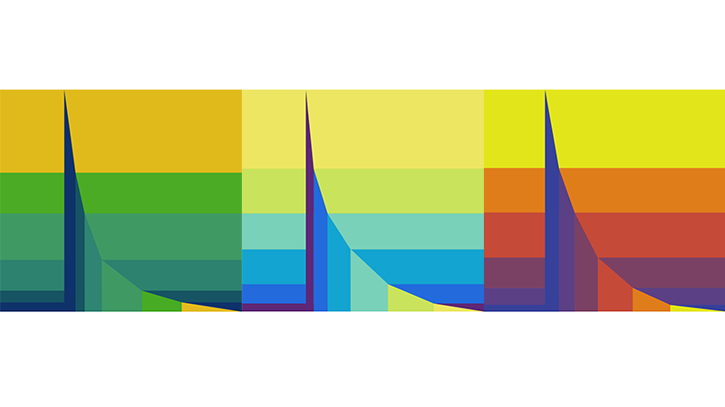

--- 
authors: 
  - "Filip Czekajlo"
authors-url: 
  - "https://github.com/filipczekajlo"
layout: project
title: "Herbert Bayer - deconstructing master artists"
type: project
authors:
  - "Filip Czekajlo"  
---
## Deconstructing Master Artists

## The Task
The task is to choose an artist/designer and analyse their art style in order to find recurring rules and variables which then need to be recreated in Javascript using P5. The idea is to create a script which outputs generative art pieces resembling the artists art style.

## Herbert Bayer 
Herbert Bayer was an Austrian Graphic Designer and Artist who was born in 15.04.1900 and died in 30.09.1985. He was born in Austria but moved to Germany and later on to the USA.

## Art/Design Career
His art career began as he started an education in an art industry atelier specialising in architecture. After that he studied in the Weimar Bauhaus (1921 - 1925) in which he was eduacted by some very popular artists like Johannes Itten, Paul Klee and Wassily Kandinsky. Moving on, he became the leader of the newly formed printing and advertisement department in Bauhaus Dessau. There he made some very important decisions like introducing print-paper in DIN and popularizing lowercase letters. Those things were some fundamentally essential steps for creation of the creation of graphic design. In 1928 he left Bauhaus, moved to Berlin. By becoming Art Director for the Vogue he continued his focus on advertisement but he also took interest in photography and painting. Since 1933 he used his advertisement skills to spread Nazi propaganda.

## Analysis
Bayers has a wide variety of different types of art pieces, but his colorful, geometrical and abstract works have the most structure, hence those will be analysed in this project. 

"Chromatic Twist" is a very popular image made by Bayer. It is is an abstract portrayal of different colors. Upon looking into similar images  one will notice a lot of parallels which make make up this unique art style.

 

All shown images are mad out of simple 2-Dimensional shapes. Allthough, by arrangement, they may create a 3-Dimensional illusion. They may overlap each other but they never merge together.

 

His colors are very vibrant (allthough softer and lighter color tones are occasionally used as background colors)

 

There is always some reification. One can always see forms which actually don't exist.

 

There are no soft color gradients and they always change in one direction of the color spectrum.

The latter image is the main inspiration to the project. Using this as a baseline combined with colors from his other images it shows curves of different magnitude. The hardest part is to create an algorithm that is random enough to make bars of different thickness, but at the same time doesn't distort the proportions of the image. By making them all independent of each other this problem becomes fairly managable.

 

Using the given rules one can create randomly generated images like the ones shown above.

---------------------------------

License (MIT)

(c) 2017 Filip Czekajlo, University of Applied Sciences Potsdam (Germany)

Permission is hereby granted, free of charge, to any person obtaining a copy of this software and associated documentation files (the "Software"), to deal in the Software without restriction, including without limitation the rights to use, copy, modify, merge, publish, distribute, sublicense, and/or sell copies of the Software, and to permit persons to whom the Software is furnished to do so, subject to the following conditions: The above copyright notice and this permission notice shall be included in all copies or substantial portions of the Software. THE SOFTWARE IS PROVIDED "AS IS", WITHOUT WARRANTY OF ANY KIND, EXPRESS OR IMPLIED, INCLUDING BUT NOT LIMITED TO THE WARRANTIES OF MERCHANTABILITY, FITNESS FOR A PARTICULAR PURPOSE AND NONINFRINGEMENT. IN NO EVENT SHALL THE AUTHORS OR COPYRIGHT HOLDERS BE LIABLE FOR ANY CLAIM, DAMAGES OR OTHER LIABILITY, WHETHER IN AN ACTION OF CONTRACT, TORT OR OTHERWISE, ARISING FROM, OUT OF OR IN CONNECTION WITH THE SOFTWARE OR THE USE OR OTHER DEALINGS IN THE SOFTWARE.

See also http://www.opensource.org/licenses/mit-license.php

