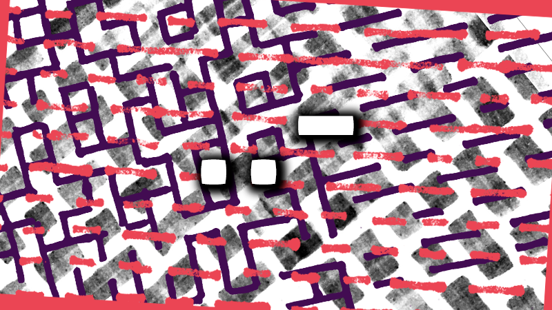
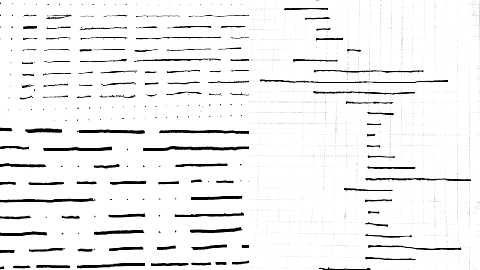
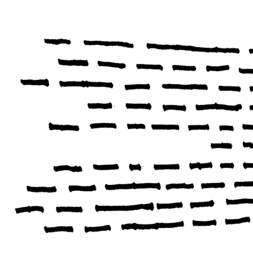
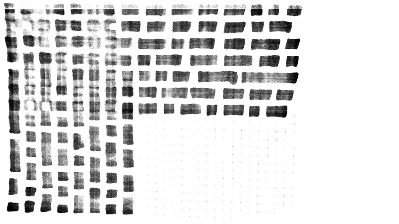

--- 
authors: 
  - "Malte Völkner"
authors-url: 
  - "https://github.com/MalteVoelkner"
layout: project
title: "PunktPunktStrich / ..-"
summary: A introduction into computer generated art
type: project

---
 


## Description
The following project shows an introduction into the most important thing of computer generated art: algorithms. By taking advantage of basic, analog algorithms to get a better understanding on how algorithms work and how to improve them throughout the process of creating art.

The assignment was part of the course [Gestalten in Code – Die Grundlagen Generativer Gestaltung](https://incom.org/workspace/6886) held by [Fabian Morón Zirfas](http://fabianmoronzirfas.me/) at the [University of Applied Sciences Potsdam](https://www.fh-potsdam.de/) in winter 2016/2017.

## Assignment
The native assignment was to create a simple, analog algorithm. The algorithm was supposed to be executed by fellow students and to be improved based on their feedback. Further conditions stated that the algorithm needs to be doable on paper, as well as taking a maximum of five minutes to be executed. An additional term was a strict definition of the used hardware (*for example the type of paper used*).

## Inspiration
The project was inspired by Morse code and its alphabet. Morse code is a method of transmitting text as a series of on- or off-signals (*with the best-known being “SOS”: ••• — — — •••*). Morse code is a great comparison to analog and digital algorithms: a human input changes its form into a computer-readable input while keeping the same message. Written code has a fascinating look and got me to persuade it as my perception of computer generated art.


## 1ˢᵗ Iteration
These are the first instructions that were given out for the first few try-outs:

```text
Black lines in a squared grid only.
Solely horizontal lines, only from dot to dot.
Each row has to begin with a line with the length “x”.
All following lines have to be either half- or twice as long as the previous line.
Between every row needs to be a distance of “x”.

You have five minutes to complete this task.
```

The executors were all given a DIN A5-sized paper (148 by 210mm, squared grid) and the same pen, a black marker with a medium thickness. Besides the abovementioned instructions no other information were given. These were the first results I got back:



Almost every proband had a different approach to the given task, which was a result of unclear instructions. Giving enough room for interpretation was part of the initial assignment but the results were to different to compare them with each other.

## 2ⁿᵈ and 3ʳᵈ Iteration
The following two iterations were based on the feedback from the first instructions that were handed out. The most common feedback was that the instructions were not definitive enough – there was too much room for the testers own interpretation. 

### 2ⁿᵈ Iteration
 The second change in the instructions were mostly clearer and easier to understand instructions. Changes have been marked with a > in front of the row. As you may notice, the use of paper was more conditioned as well as a difference between the length of the line and the length of the distance between two rows. These changes did not affect the outcome very much but closed the gap of differences between two different results.

```text
> Black lines in a squared, dotted grid only.
Solely horizontal lines, only from dot to dot.

Each row has to begin with a line with the length “x”.
> All following lines need to be either x, x*2 or x/2 long.

> Between every row needs to be a distance of “y”.
> y has to be the same throughout the whole page.

You have five minutes to complete this task.
```

### 3ʳᵈ Iteration
The next iteration was a try-out that was later removed from the algorithm. To create a more exciting and lively picture the following instruction were added to the abovementioned directives: `The lines of two consecutive rows cannot start at the same vertical level.` As expected, the pictures were suspenseful but not the planned result. This is an example from the 3rd iteration:



## 4ᵗʰ and final Iteration

After the third try was reset different ways to create more fascinating pictures were explored. One of the tested attempts added another dimension to the assignment the executors were given. The following instructions were handed out; again, the >-symbol signalizes a change in the instructions.

```text
Black lines in a squared, dotted grid only.
> Start in one corner and only draw horizontally.
> Turn the paper by atleast 90° at a moment of your choice.
> Start over the instructions from the new selected corner.

Each row has to begin with a line with the length “x”.
All following lines need to be either x, x*2 or x/2 long.

Between every row needs to be a distance of “y”.
y has to be the same throughout the whole page.

> You have eigth minutes to complete this task.
```

Caused by the instructions to have doubled the performer got a few more minutes to complete the task. The results were more interesting than the previos iterations. Showy patterns were created, some of which were completely different than the first iteration. The two following pictures were my favorites of the results by the fourth iteration.




---

## License (MIT)

© 2017 • [Malte Völkner](https://github.com/MalteVoelkner)

Permission is hereby granted, free of charge, to any person obtaining a copy of this software and associated documentation files (the "Software"), to deal in the Software without restriction, including without limitation the rights to use, copy, modify, merge, publish, distribute, sublicense, and/or sell copies of the Software, and to permit persons to whom the Software is furnished to do so, subject to the following conditions:

The above copyright notice and this permission notice shall be included in all copies or substantial portions of the Software.

THE SOFTWARE IS PROVIDED "AS IS", WITHOUT WARRANTY OF ANY KIND, EXPRESS OR IMPLIED, INCLUDING BUT NOT LIMITED TO THE WARRANTIES OF MERCHANTABILITY, FITNESS FOR A PARTICULAR PURPOSE AND NONINFRINGEMENT. IN NO EVENT SHALL THE AUTHORS OR COPYRIGHT HOLDERS BE LIABLE FOR ANY CLAIM, DAMAGES OR OTHER LIABILITY, WHETHER IN AN ACTION OF CONTRACT, TORT OR OTHERWISE, ARISING FROM, OUT OF OR IN CONNECTION WITH THE SOFTWARE OR THE USE OR OTHER DEALINGS IN THE SOFTWARE.
