--- 
authors: 
  - "Edmundo Mejía Galindo"
authors-url: 
  - "https://github.com/edgalindo"
layout: project
title: Fractalistics
type: project
---

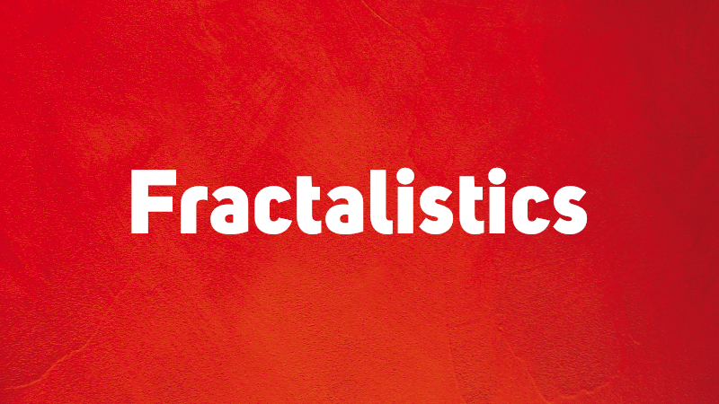

## Introduction – Analog Algorithms
The first part of project was to define and describe a simple algorithm in words in one sentence. It should be implemented (translated) with analog drawings by other subjects to improve that the description could be understood and drawn without any other help. The interpretation of the description for the artwork was completely free for every single subject.  

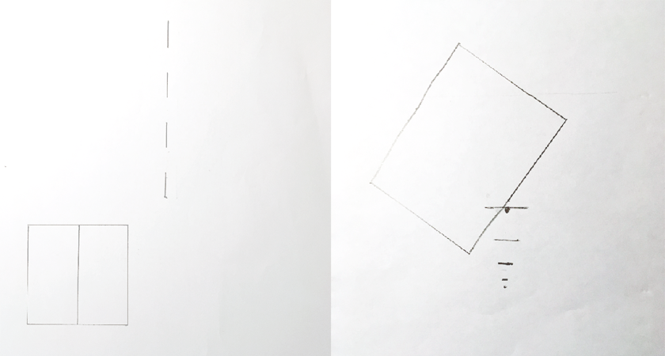

To decipher of the "first exercise" was to complex to understand and draw with simple lines. The described and nested instructions were to long for the intentioned goal.

## Algorithm – Definition

>A fractal is a never-ending pattern. Fractals are infinitely complex patterns that are self-similar across different scales. They are created by repeating a simple process over and over in an ongoing feedback loop. Driven by recursion, fractals are images of dynamic systems – the pictures of Chaos. Geometrically, they exist in between our familiar dimensions. Fractal patterns are extremely familiar, since nature is full of fractals. For instance: trees, rivers, coastlines, mountains, clouds, seashells, hurricanes, etc. Abstract fractals – such as the Mandelbrot Set – can be generated by a computer calculating a simple equation over and over.  
>[Source: Fractal Foundation](http://fractalfoundation.org/resources/what-are-fractals/)

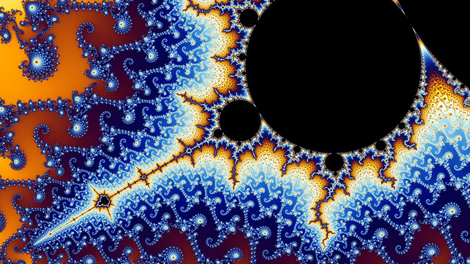

>[Datei:Mandel zoom 08 satellite antenna.jpg](https://de.wikipedia.org/wiki/Datei:Mandel_zoom_08_satellite_antenna.jpg), licensed under [Commons:GNU Free Documentation License, version 1.2](https://commons.wikimedia.org/wiki/Commons:GNU_Free_Documentation_License,_version_1.2) / Adapted to image size

Fractals are interesting and fascinating structures, that can be found in the nature in many different ways. Fractals were the next inspiration to define and describe a new algorithm for the second part of the task. The goal was to offer clear and short instructions, that help other to solve easily the artwork.

The basic idea was to concatenate simple basic shapes, which should change their size in succession. The subjects could independently decide how to draw the surfaces in their length, but also the size and direction of the display and the concatenation should be a part of the final artwork. Fifteen subjects drawn an artwork with the description of the algorithm described in the 1. iteration.

## 1. Iteration

The instructions for the first iteration were described as a short list with clearer statements to make the iteration more understandable and easier for resolving the new variables:  

>1. Use a piece of paper in any size you like (white, black, in different colors, with lines, etc.)
>2. Draw a circle with at least 5mm in diameter at any point of the side on the paper
>3. Draw a square about 5mm larger than the circle area you have already drawn before. The square and the circle must touch each other at any tangent, side or corner.
>4. Draw a triangle (equilateral, square or isosceles). The surface of the triangle should be approximately 5 mm larger than the area of the square. The triangle must touch the square at any side or corner.
>5. Draw a pentagon, which should be 5 mm larger than the triangle. The pentagon has to touch the triangle also at any side or corner that you prefer.
>6. Repeat steps 1 to 5 till you finish an own artwork composition. Notice that the pentagon is now the starting point for the repetition because this shape was the last drawn area.
>7. Fill out some of the shapes as you wish (colorful or black and white).

## Materials
The task for the artwork was to choice the paper, drawing materials (pencils, pens, crayons, markers, etc.) and also such as ruler, compass, and other different materials for drawing. An overview of the diversity of the designed drawings are shown below. All artworks were consistently chosen in an A4 (297mm x 210mm) format.

## Variables/Constants/parameters
Several materials for the work were offered so that the subjects could choose any of these completely free. The sequence of the algorithm for the artwork should be done as it was defined (see reloaded Iteration). The timeline was a fixed instruction for the production of the task for everyone.

The variables were the selection of subjects: 1 lawyer, 1 marketing leader, 1 social worker, 1 manager and 10 design students. The result of the artworks were very interesting and diverse. They worked through the procedure very surprising and unexpected. Depending on the personality and of course much more on the profession (various professional fields) subjects who are dealing with text, management or science, read first very concentrated and carefully the hole text before start working on it. In the second step they work step by step slower and sometimes to carefully. They proved and checked their steps and tried to correct a part of the drawing. Designers have partially read the text, it means they solved the task more open and flexible.

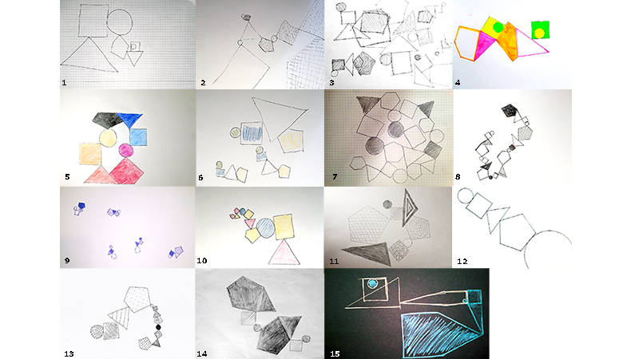

_(1) Markus, (2) Dimitri, (3) Adina, (4) Thilo, (5) Fabian, (6) Isabell, (7) Johannah, (8) Pam, (9) Dustin, (10) Stefan, (11) Annabel, (12) Julia, (13) Niko, (14) Martin, (15) Jule_

## Criticism
The results of the subjects were well done, however, all geometric surfaces should be connected to each other. Some have formed several small chains. The explanation at point 6 was perhaps not clearly described for this step. Examples 1-2-4-5-8-10-11-12-13-14-15 show the correct solution provided though. In the following artwork, it is shown a version of a wished solution:

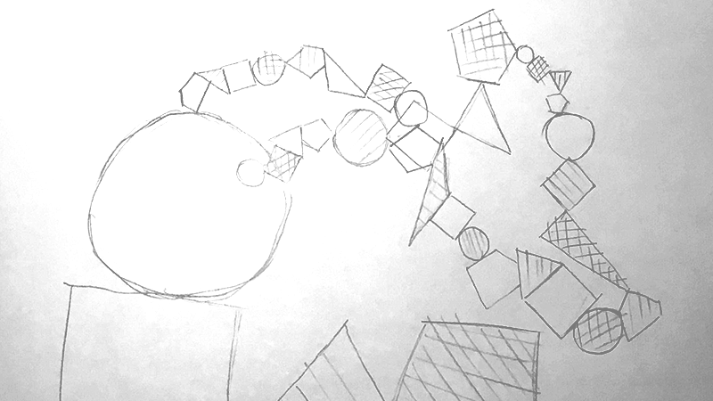

## Conclusion
The vocabulary for definition and description for notes (readability and legibility) and guidance of an order within a project should contain brief, "very simple" and clear words. The subjective perception of the subjects and their attention during reading also plays a strong role here. The investigation of the aspects mentioned is subverted in the psychology of perception in various ways. Book recommendation: Visual perception by Jürg Nänni.

## 2. Iteration

The critical aspects of the first iteration were important to rethink and redefine a clearer, shorter and more accurate description to make the artwork with the targeted description. Some of these aspects were:

>1. Free choice of work surface (material characteristics)
>2. Free choice of drawing materials
>3. The series of produced artworks makes it difficult to find comparisons
>4. Mathematical size - difficult to calculate
>5. Work steps too complex and long described
>6. Open time limit in the execution of tasks

## New Variables/Constants/parameters
The constants were defined for this step using only black cardboard
 and white pencil. The subjects were aloud only to draw geometric shapes. These forms (square, triangle or circle) could be drawn in different sizes with variable line strengths. The constant was that all of them must be connected with each other in a corner, side or tangent at the same time. The connection of the shapes could be repeated independently to build a shape chaining.

 The subjects had the freedom to try some defined variables like drawing shapes in self determined arrangement, also choosing touch points, their overlapping and side length were also free. The time limit of 15 minutes was also an aspect that should be respected.

## Definition
With the above informations could be described a new definition for the second iteration. By the new definition was easier to compare the developed serial results of the artworks. I decided to describe 5 different definitions for the iteration. I wanted to find out, which of them could be in the artwork results the most interesting and developable.

**01. Alternative**

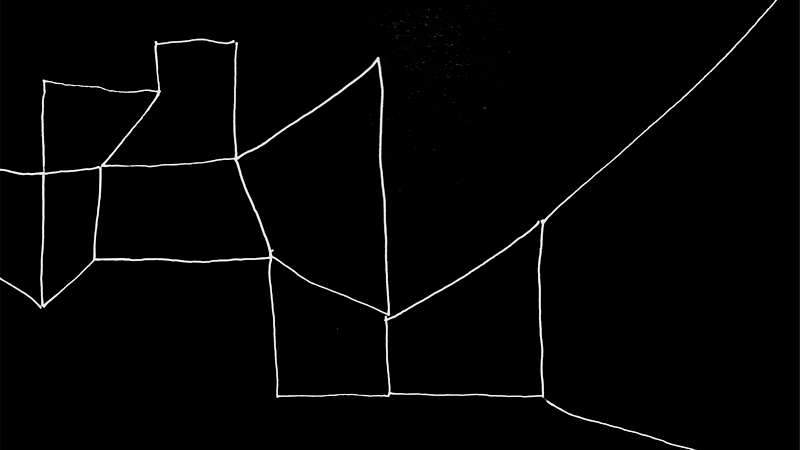  

>1. Please read the instructions first (processing time max. 15 minutes)
>2. Draw a square shape with oblique sides at the edge of the paper
>3. Place the pencil at the vertex of one side length and draw 3 more sides, so that beside the first square another new one is drawn.
>4. Repeat the third step, varying the side lengths (large and small) drawing new shapes until you reach two corners of the opposite side of the paper. You can draw new squares choosing a random side of the other squares that are already drawn before.

**02. Alternative**

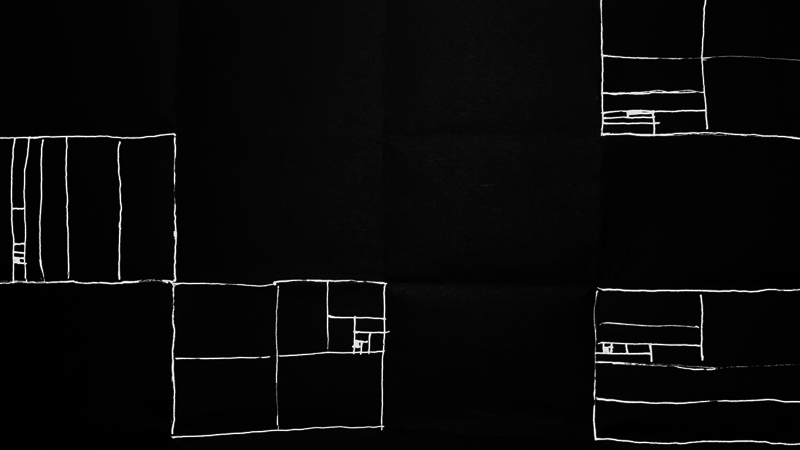

>1. Please read the instructions first (processing time max. 15 minutes)
>2. Fold the sheet vertically into two equal parts
>3. Fold the folded sheet horizontally back into two equal parts
>4. Fold the sheet as in steps 2 and 3 again
>5. Open the sheet and select one of the resulting rectangles (fold lines)
>6. Draw the fold lines with the pencil
>7. Divide the drawn rectangle into 4 equal rectangles
>8. Divide one of the rectangles into 2 more equal rectangles and repeat this step until you can't divide it any more.
>9. Select a new rectangle (fold lines) and repeat steps 6 to 8. After that your composition is finished.

**03. Alternative**

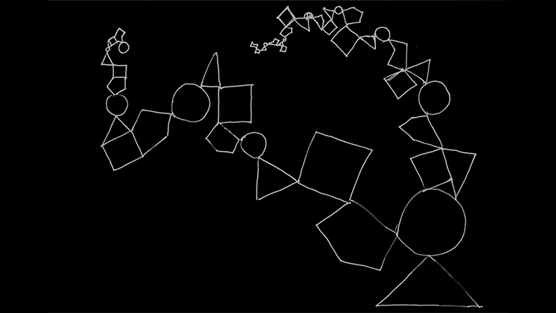

>1. Please read the instructions first (processing time max. 15 minutes)
>2. Draw a tiny circle on the leaf
>3. Draw a larger triangle that touches the circle
>4. Draw an even larger square that touches the triangle
>5. Draw again a larger pentagon that touches the square
>6. Draw a larger circle that touches the pentagon
>7. Repeat steps 2 to 6 five times
>8. Repeat step 2 to 6 another five times, but invert the steps

**04. Alternative**

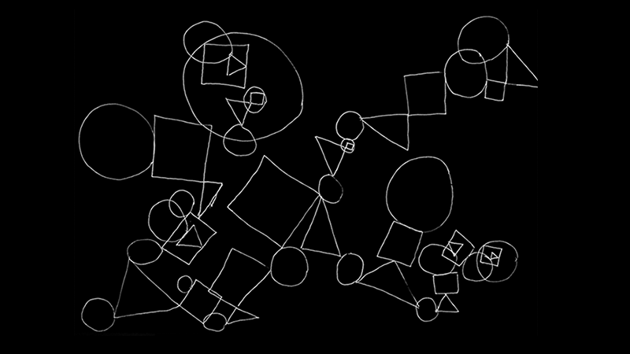

>1. Please read the instructions first (processing time max. 15 minutes)
>2. Draw 10 circles with different diameters on the sheet
>3. Draw a square for each circle that touches each circle. Each square should have a different size to the connected circle (smaller or larger)
>4. Draw a triangle for each square that touches each square. The size of each triangle must be changed (smaller or larger)
>5. Draw a circle for each triangle that touches each triangle. The size of each circle should be different than the size of corresponding triangle (smaller or larger)
>6. Repeat steps 3 to 5 until at least 3 separate structures are connected with each other.

**05. Variant**

>1. Please read the instructions first (processing time max. 15 minutes)
>2. Draw a square shape (diamond, rectangle, trapezoid, square) in the center of the work surface
>3. Select a side length of the shape and draw a new shape (rhombus, rectangle, trapezoid, square).
>4. Rotate the sheet 90 degrees and repeat steps 2 and 3 several times. The drawn side lengths should get smaller in the new drawn shapes until you aren't able to draw more shapes on the sheet, then you're done.

## 3. Iteration
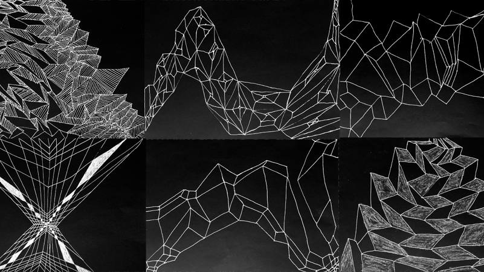

The last iteration had the goal to simplify the description for the artwork iteration. All parameters, variables and constants were summarized in one paragraph:

>Draw a square shape with oblique sides at the edge of the work surface and afterwards draw other quadrangles, which are connected with the preceding one. Variate the side lengths. Draw the quadrangles that become smaller and then larger again until two corners of the sheet are full drawn with quadrangles. When you finish the artwork, just try to hatch some of the figures if you like. 

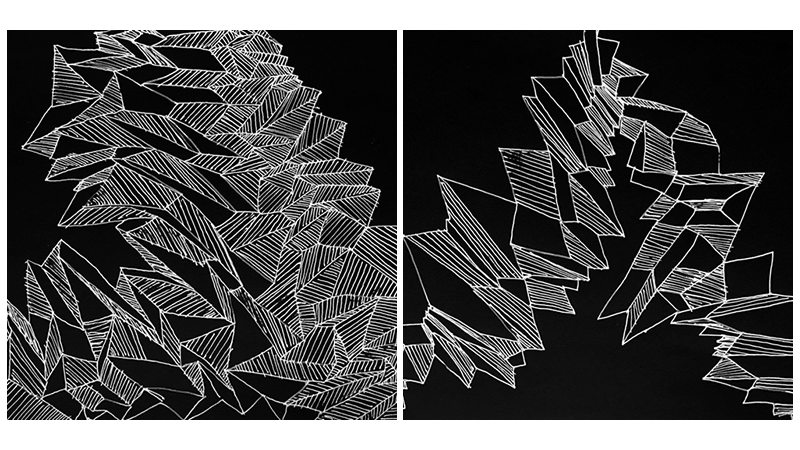
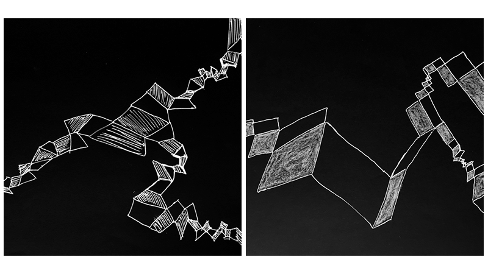

One last point in this iteration was corrected by Fabian Morón Zirfas (our Lecturer), because the description of the definition in a list looks more legible to the subjects: 

>- Draw square shapes that touch each other
>- The length of the sides must vary
>- The shapes should not be drawn parallel to the sheet edges
>- The forms decrease and increase (linear, exponential, ...)
>- The forms can be partly hatched

Nevertheless the results that are shown above at this iteration are exactly the goal what it should be shown in every single artwork of subjects.

## License (MIT)

©  February 2017 Fh Potsdam (University of Applied Sciences), Edmundo Mejia Galindo & Fabian Morón Zirfas

This is free and unencumbered software released into the public domain.

Anyone is free to copy, modify, publish, use, compile, sell, or
distribute this software, either in source code form or as a compiled binary, for any purpose, commercial or non-commercial, and by any means.

In jurisdictions that recognize copyright laws, the author or authors of this software dedicate any and all copyright interest in the software to the public domain. We make this dedication for the benefit of the public at large and to the detriment of our heirs and successors. We intend this dedication to be an overt act of relinquishment in perpetuity of all present and future rights to this software under copyright law.

THE SOFTWARE IS PROVIDED "AS IS", WITHOUT WARRANTY OF ANY KIND,
EXPRESS OR IMPLIED, INCLUDING BUT NOT LIMITED TO THE WARRANTIES OF MERCHANTABILITY, FITNESS FOR A PARTICULAR PURPOSE AND NONINFRINGEMENT. IN NO EVENT SHALL THE AUTHORS BE LIABLE FOR ANY CLAIM, DAMAGES OR OTHER LIABILITY, WHETHER IN AN ACTION OF CONTRACT, TORT OR OTHERWISE, ARISING FROM, OUT OF OR IN CONNECTION WITH THE SOFTWARE OR THE USE OR OTHER DEALINGS IN THE SOFTWARE.

For more information, please refer to

See also http://unlicense.org/
