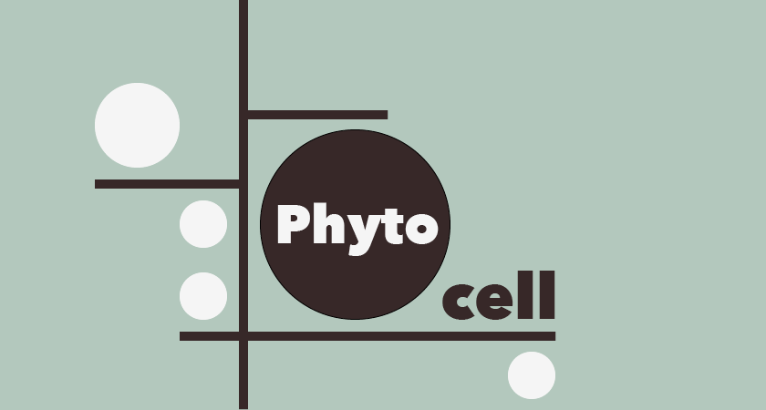
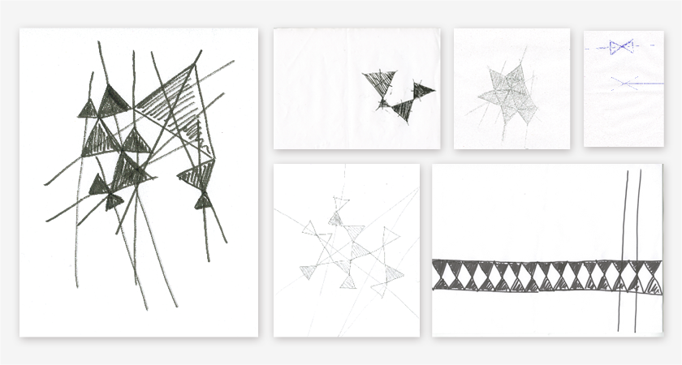
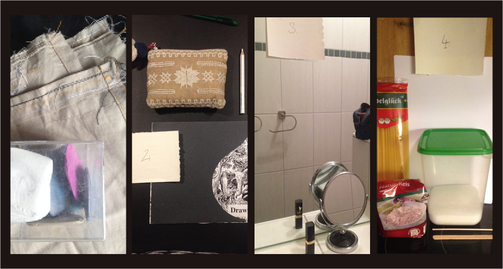
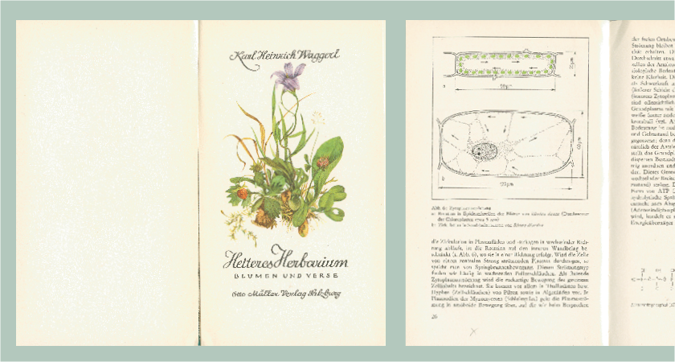

---
authors:
  - "Natalie Schreiber"
layout: project
title: "Phytocell"
type: project
---

## General

If algorithms only remind you of confusing and therefore boring math lessons in school actually you will be surprised how omnipresent and awesome they really are.  
The whole world consists of Mathematics: music, tax declarations or the mother nature itself. In most cases it is not obvious but it's there.
Sometimes mathematics seems to be very complex and at first sight beyond our comprehension but it will never get boring. No, quite the contrary: if we understand it and know how to leverage it we can create amazing things!

## Nature of Algorithms and Generative Design

Algorithms make up an important part of mathematics.
That's not only since the beginning of the digital era.
Everyone who once admired the precise structure of a snowflake appreciates designing with algorithms.

They are exact iterations in structures, enhancing themselves, building on top of another, moving away from each other, intertwining and amount as a whole to something completely new and superior.
Well, what can be more exciting for a designer than using this ordinary template, understanding, doing research into, experimenting, and adapting it - by coding?

## Getting in Touch - the Analog Algorithm

Our experience so far and from our sciolism is that we suspect that algorithms mostly deal with coding. The question is, what are they exactly?

Werner Stangl, an Austrian psychologist describes an algorithm as _a systematic, logic rule or approach which leads to the solution of the problem in hand._ [1]

Therefore we approached the answer to this question playfully in the first part of the seminar.

Everyone should write down a little assignment which instructions the other students had to follow. The results were abstract figures or drawings of these simple analog algorithms.

## Output - Specification and Variance

The 6 iterations reveal that most of the pictures deviated from the initial ones which you had in mind when setting the task.

That is because of different reasons.
On the one hand the assignment was too complex to understand it correctly. This might be one explanation why there are some random results.
On the other hand the instructions were not precise enough. But in the case when they were too exact the results were not as diverse but also lost their charm.
Sometimes the "new" results were much more interesting than the original one you had in mind.
So the thin line between precise specification and variance is an exciting and difficult point within algorithm game.

## 1st Iteration - Experiments

As a first step the new and totally different algorithms try to establish a line between exact and quite free instructions. As part of the assignment they are combined with different materials for the implementation.

### Time to say goodbye to simple pieces of paper and pen

The algorithms state that the test person shall experiment a bit with the given material. So there were installed 4 several sites. For each it was created a specific algorithm and some tools like lipstick and mirror, rice and slate, crayon etc. were provided, too.

### Inspiration

The inspiration for the different algorithms comes from structures, patterns and shapes in my environment, like the imprint of a leaf on a ceramic platter.

The fine veins and structures of the cells has the potential to display the classic natural structure in various ways.

The wording of the algorithm is:
1. Work with the provided materials/tools.
2. Draw at least one thick stroke. Radiant from this, draw as many as 3 more lines. From these as many as 5 more fine lines anon.
3. Fill the spaces in between with round shapes.

The results of this one are the best in comparison with the others. Nevertheless, the specification of the materials has to be improved. Therefore it was provided black, rough paper and white pencils with different stroke widths. But this selection was not convincing indeed.

## 2nd Iteration - The PhytoCell-Algorithm

In one of the other algorithms the used rice grains caused a strong contrast and the shape of rice grains reminds a bit of cells in an organism. Moreover, if the rice would be boiled, you can experiment in the three-dimensional space with it and additionally colorize it. My lecturer Fabian Morón Zirfas gave me this hint. Maybe this would provide exciting opportunities combining it with the PhytoCell-algorithm?

### Parameters, variables, constants

But to focus on the PhytoCell-Algorithm itself, another question is much more important:
How can you achieve that the outputs differ more from each other?
Therefore you have to elicit the parameters, variables and constants: Shapes, strokes, lines, width and quantity.
The rules are modified and fitted with different numbers of finer and thicker strokes. Additionally you can also change how the "cells" are drawn. This ranges from circles to more oval or angular shapes, from large to small, from filled to empty, and from tightly packed to lightly distributed.
Thus a new level was reached - but not yet with the rice. Simply with white paper which was partly squared.

### New ideas, new chapters
The results were very satisfying and those on the squared paper evoked a new idea concerning the material: Maybe book pages are the right answer.

The pages or figuratively leaves of a book - the connection between the organic paper and the leaf-inspired algorithm.
But the question was, if the test persons are that courageous to paint the printed book pages and to play around with structures and words.

## 3rd Iteration - Wild Rice

Nonetheless the experiment with the rice was pending.
For short: Forming the shapes took forever and it was a mess.

**I thought of something like this:**

For all food savers: of course all the rice was ate up, because it has been colorized with natural colors.

## 4th Iteration - Blank Pages Get Written
Next: the book. As it was assumed, the test persons are a bit afraid to paint the pages at first - although taking an old page-turner which wasn't near and dear to me at all. The outputs were sometimes more, sometimes less courageous. However, the differences between pleased me.

**A selection of the best**

### Little herbarium

To achieve a better link among the content of the book and the algorithm, the book had to change into a little booklet about plants, what was found in a second-hand bookshop. It includes some scientific illustrations that show the structure of plant cells and their mode of action and chemistry. Maybe you can visualize how wonderfully you could assimilate the execution of the algorithm with them!

Using the simple book for testing, it showed that the ink of the black pen bleeds so much that you can see it on the back page. (I still haven't found a satisfying solution or good pen for it. One idea would be to insert transparent paper for the drawings.)

## Conclusion

Whatever the case may be, the assignment accompanies me beyond. I'm taking the test-book with me and from time to time I put it and the algorithm into someones hand and see what happens. Eventually I want to accumulate the results and transcribe the best outputs into the plant book - another way of a plant collection.

[1]: Werner Stangl: Algorithmus; lexikon.stangl.eu; http://lexikon.stangl.eu/3027/algorithmus-algorythmus-algorhythmus/ (30.03.2017)
