---
authors:
  - "Natalie Schreiber"
layout: project
title: "Projekt 1 | Algorithmus | Phytocell"
type: project
---

# Analog Algorithm | PhytoCell

## General

_Algorithms? That reminds me of confusing and therefore boring math lessons in school.
I'm done with it._

You're not.

The whole world consists of Mathematics: music, tax declarations or the mother nature itself.
In most cases it is not obvious but it's there.
Sometimes mathematics seems to be very complex and at first sight beyond our comprehension but it will never get boring.
No, quite the contrary: if we understand it and know how to leverage it we can create amazing things!

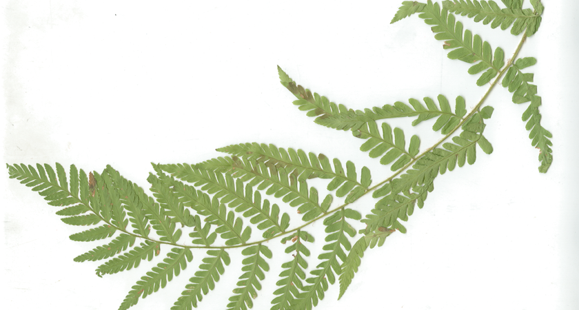

## Nature of algorithms and generative design

Algorithms make up an important part of mathematics.
That's not only since the beginning of the digital era.
Everyone who once admired the precise structure of a snowflake appreciates designing with algorithms.

They are exact iterations in structures, enhancing themselves, building on top of another, moving away from each other, intertwining and amount as a whole to something completely new and superior.
Well, what can be more exciting for a designer than using this ordinary template, understanding, doing research into, experimenting, and adapting it - by coding?

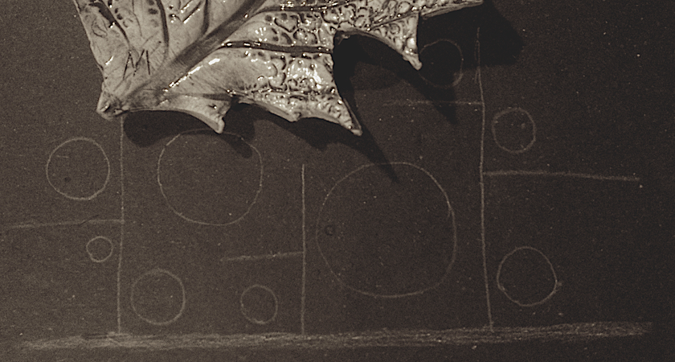

## Getting in touch - the analog algorithm

Our experience so far and from our sciolism is that we suspect that algorithms mostly deal with coding. But...what exactly?
Werner Stangl, an Austrian psychologist describes an algorithm as _a systematic, logic rule or approach which leads to the solution of the problem in hand._ [1]

Aha.
Well then?

Therefore we approached the answer to this question playfully in the first part of the seminar. Each student should come up with an assignment and write it down on a piece of paper. If you exactly follow the instructions you would get a certain (abstract) figure or drawing as a result - a simple analog algorithm.
We swapped the assignments with one another and everyone had 3 minutes to fulfill the task within the scope of the predefined rules.
After the 3 minutes were up we swapped again and so on and so forth.

## Output - specification and variance

After 6 iterations we had the results: most of the pictures deviated from the initial one that you had in mind when setting the task.

That is because of different reasons.
On the one hand the assignment was too complex to understand it correctly. This might be one explanation why there are some random results.
On the other hand the instructions were not precise enough. But in the case when they were too exact the results were not as diverse but also lost their charm.
Sometimes the "new" results were much more interesting than the original one you had in mind.
So the thin line between precise specification and variance is an exciting and difficult point within algorithm game.

## 1st Iteration - Experiments

As a first step I wanted to play further more with the different algorithms to establish a line between exact and quite free instructions. As part of the assignment I also combined them with different materials for the implementation.

### Time to say goodbye to simple pieces of paper and pen
The algorithm stated that the test person should experiment a bit with the given material. So I installed 4 several sites at home. For each I created a specific algorithm and provided the tools like lipstick and mirror, rice and slate, crayon etc.

### Inspiration
For the different algorithms I got my inspiration from structures, patterns and shapes in my environment, like the imprint of a leaf on a ceramic platter.

The fine veins and structures of the cells had the potential to display the classic natural structure in various ways.

The algorithm was:
1. Work with the provided materials/tools.
2. Draw at least one thick stroke. Radiant from this, draw as many as 3 more lines. From these as many as 5 more fine lines anon.
3. Fill the spaces in between with round shapes.

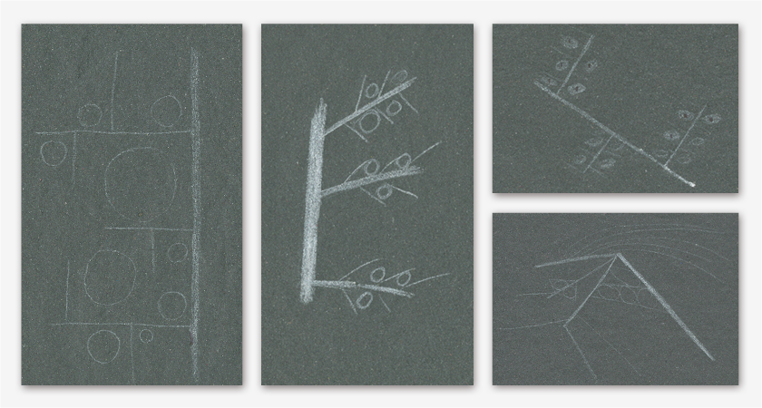

The results of this one I liked best in comparison with the others. Nevertheless I wanted to improve the specification of the materials. I had provided black, rough paper and white pencils with different stroke widths. But this selection didn't convince me.

## 2nd Iteration - The PhytoCell-Algorithm

In one of the other algorithms the used rice grains caused a strong contrast and their shape reminded me a bit of cells in an organism. Moreover, if the rice would be boiled, you can experiment in the three-dimensional space with it and additionally colorize it. My lecturer Fabian Morón Zirfas gave me this hint. Maybe this would provide exciting opportunities combining it with the PhytoCell-algorithm?

### Parameters, variables, constants

But for the moment I wanted to concentrate on the PhytoCell-Algorithm itself. How can I achieve that the outputs differ more from each other?
Therefore I elicited the parameters, variables and constants: Shapes, strokes, lines, width and quantity.
I modified the rules and had them draw with different numbers of finer and thicker strokes. Additionally you can also change how the "cells" are drawn. This ranges from circles to more oval or angular shapes, from large to small, from filled to empty, and from tightly packed to lightly distributed.
Thus I ran the next stage - but not yet with the rice. Simply with white paper which was partly squared.

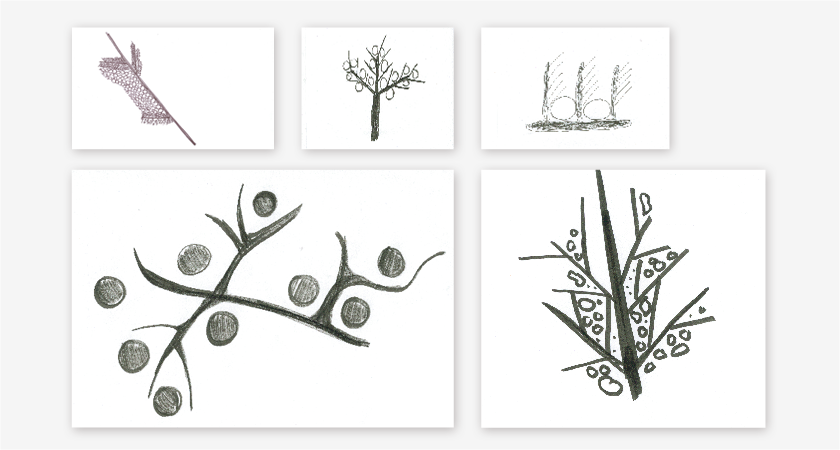

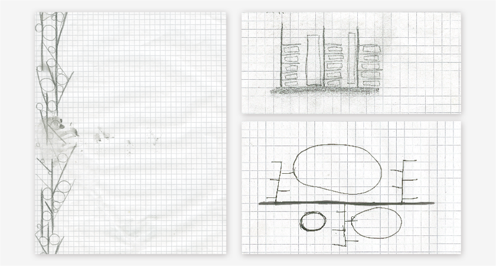

### New ideas, new chapters
I was very confident of the results and those on the squared paper gave me a new idea concerning the material: Why shouldn't I choose book pages? The pages or figuratively leaves of a book - the connection between the organic paper and the leaf-inspired algorithm!
But would the test persons be so courageous to paint the printed book pages? Including the structure and playing with words?

## 3rd Iteration - Wild rice

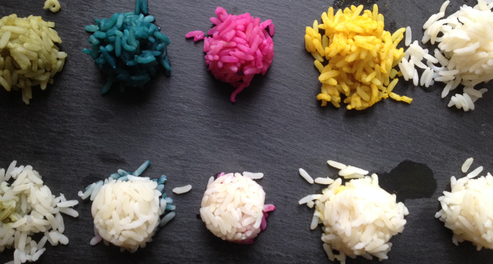

Nonetheless I tried the experiment with the rice - and left it at that.
For short: Forming the shapes took forever and it was a mess.

**I thought of something like this:**

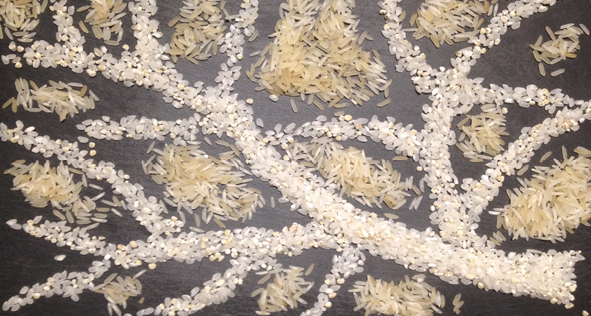

For all food savers: of course I ate up all the rice, because I had colorized it with natural colors.

## 4th Iteration - Blank pages get written
Next: the book. As I assumed, the test persons were a bit afraid to paint the pages at first. Although I took an old page-turner which wasn't near and dear to me at all. The outputs were sometimes more, sometimes less courageous. However, the differences between pleased me.

**A selection of the best**

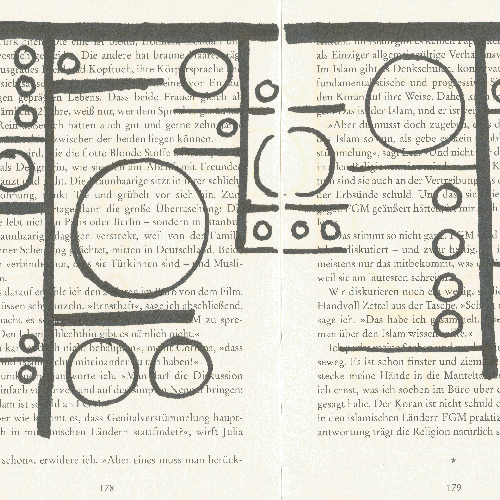

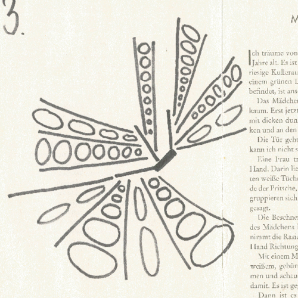

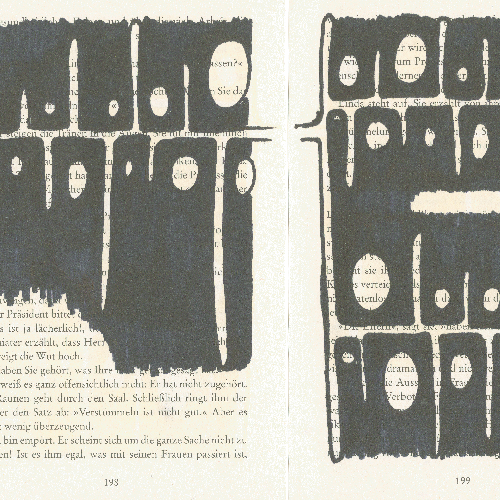

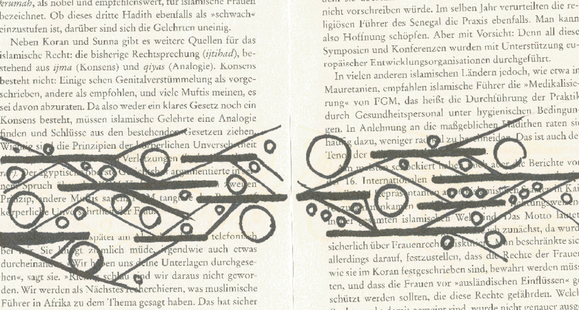

### Little herbarium
To achieve a better link among the content of the book and the algorithm, I bought a little booklet about plants from a second-hand bookshop. It includes some scientific illustrations that show the structure of plant cells and their mode of action and chemistry. I visualized how wonderfully you could assimilate the execution of the algorithm with them!

But I didn't dare to touch it.
Using the simple book for testing, I realized that the ink of the black pen bleeds so much that you can see it on the back page. I still haven't found a satisfying solution or good pen for it. One idea would be to insert transparent paper for the drawings.

## Conclusion
Whatever the case may be, the assignment accompanies me beyond. I'm taking the test-book with me and from time to time I put it and the algorithm into someones hand and see what happens. Eventually I want to accumulate the results and transcribe the best outputs into the plant book - another way of a plant collection.

[1]: Werner Stangl: Algorithmus; lexikon.stangl.eu; http://lexikon.stangl.eu/3027/algorithmus-algorythmus-algorhythmus/ (30.03.2017)
