---
authors:
  - Joshua Pacheco
authors-url:
  - "http://incom.org/profil/7029"
layout: project
title: "Paths: An exploration of analogue algorithms"
type: project
---
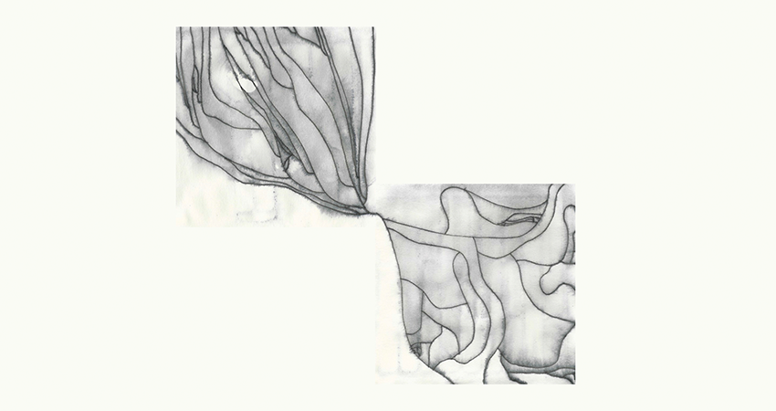

## An exploration of analogue algorithms

This work is part of a class at the University of Applied Sciences Potsdam. The project engages in analogue generative design. Initially an analogue algorithm has been written. Inspiration was supported by algorithms, Sol LeWitt uses to give his assistants to execute art works in his name. This initially analog algorithm has been extended and developed over many iterations and finally put in form.  

For the algorithms first iteration pencils and sheets of paper were handed to 5 people. They were instructed to consequently follow the rules of the algorithm listed below.  

### Iteration 1:  

Draw a rectangular form that is larger than half of the sheet. Draw another form into the first form, that is larger than half of the this first form and one that is smaller. Draw another two forms into each of the previous forms, one of them smaller and one larger than the previous form. Repeat until the sheet is full.

The results turned out to be rough and did not fulfill the visual expectations.
Therefore in the following steps the algorithm has continuously been adjusted to the impressions of natural and organic structures. A town from above, bark of a tree, river courses and serpentines in the mountains.

### Iteration 2:  

Draw a path from one border of your sheet to another border. Draw another path starting at one point of your first path. Again conduct the path to a border of the sheet. Draw another path starting at a point of your newest Path. Conduct the path to a border of the sheet, without cutting one of your previous paths. Continue as long as possible.  

This text was handed to 10 people. All of them were using the same pencil and a square sheet of paper, while following the algorithms rules.  

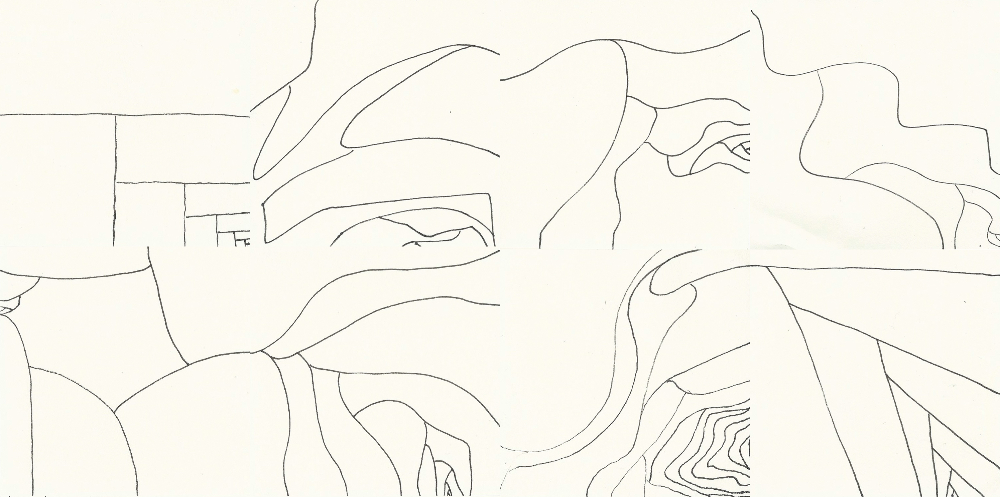

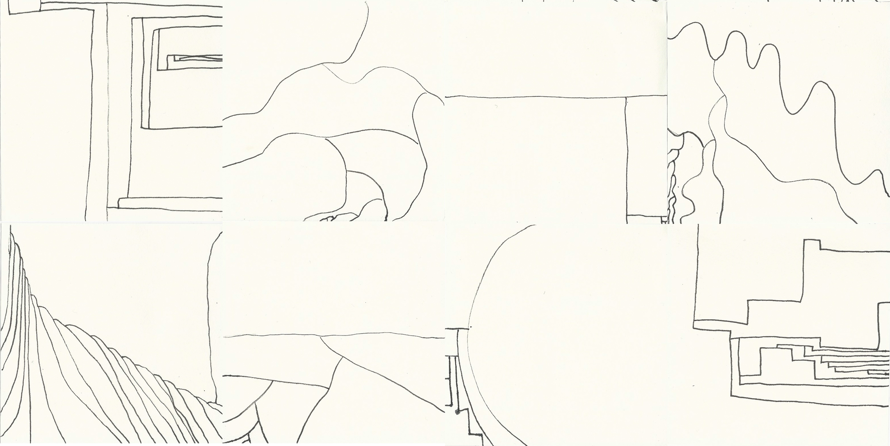

The results emerged more organic and individual. Still they seemed rather flat.  

### Iteration 3:  

Please read everything first.  
Draw a path from one border of your sheet to another border. Draw other paths, always starting at one point of your most recent path conducting to a border of the sheet. The paths may not cut each other. Change the pencil for every path you draw. Continue as long as possible.  

Again this text was handed to 10 people. All of them were using a square peace of very thin paper and extra moist markers in different shades of blue.  

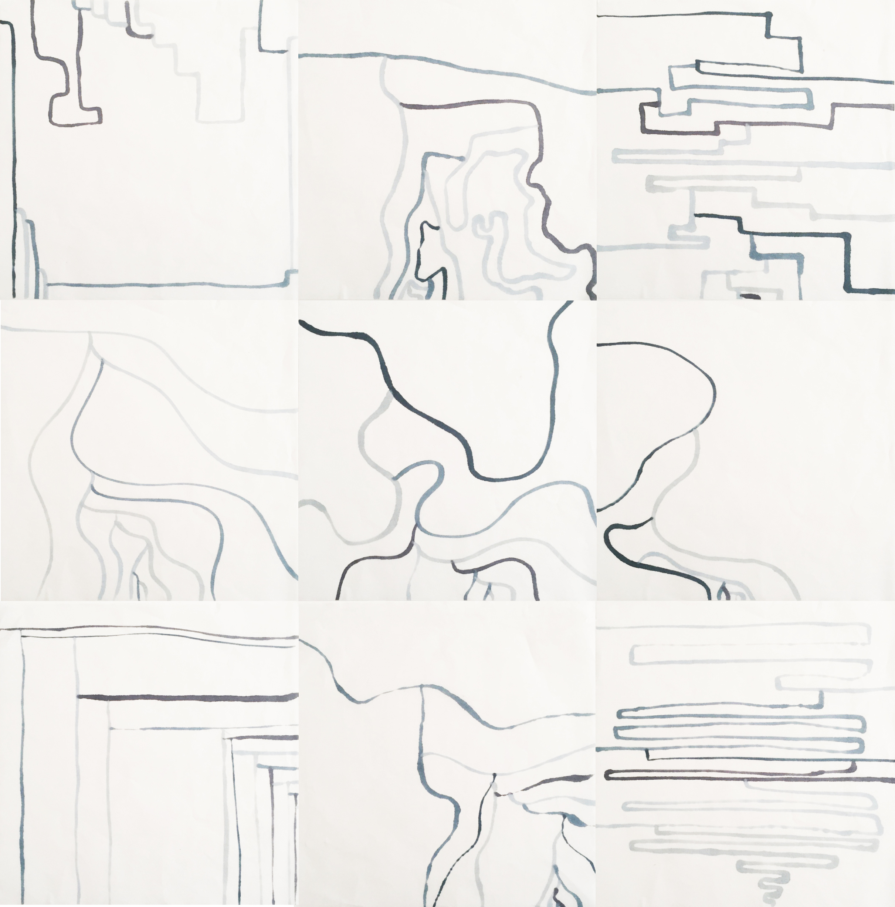

The results became a little more organic due to the varying stroke width. The varying colours yet broke the overall pattern. Also the general stroke width overstrained the sheets size, as there was not enough room to get into many details.  

For the final iteration the algorithm was adjusted to achieve a richer picture. Also a thinner pencil and a stronger paper were provided.  

### Iteration 4:  

Please read very carefully first.  
Draw a path from one border of the sheet to another border.  
Draw other paths, always starting at one point of your most recent path conducting to a border of the sheet. Continue as long as possible.  
Restart the process at least another three times, starting from a border or an existing path of your choice. Always conduct the path to a border or another existing line.  
The paths may never cut each other.  
As soon as you are done, shortly hold the paper into the provided water.  

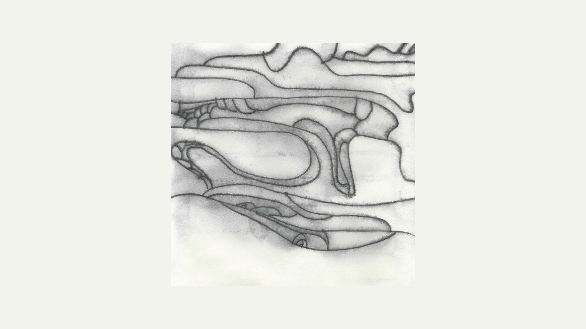
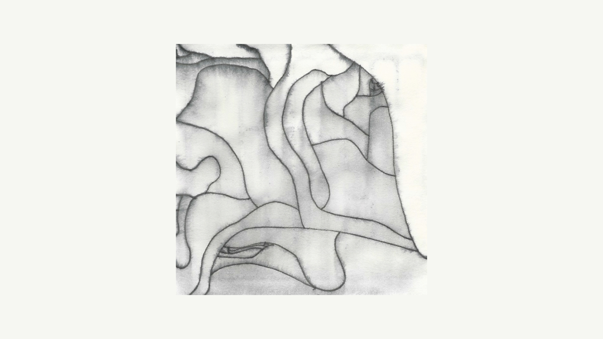
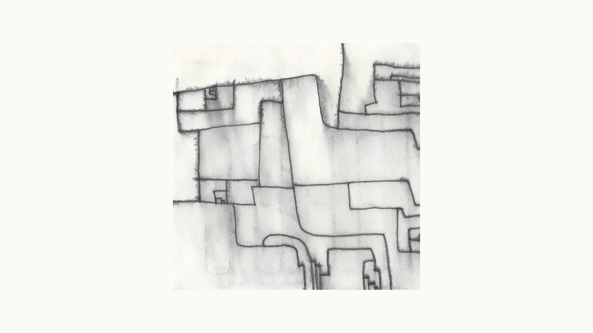
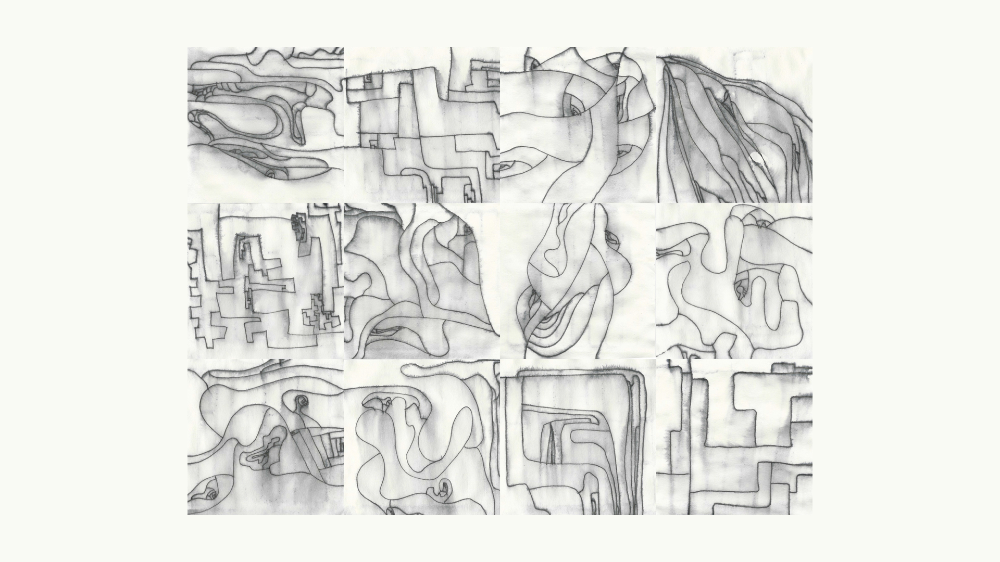

The satisfying results especially opened new rooms and spaces when put and alined together.  
The varying intensity of the leaking colour provided the drawings with another layer of random depth and movement.  

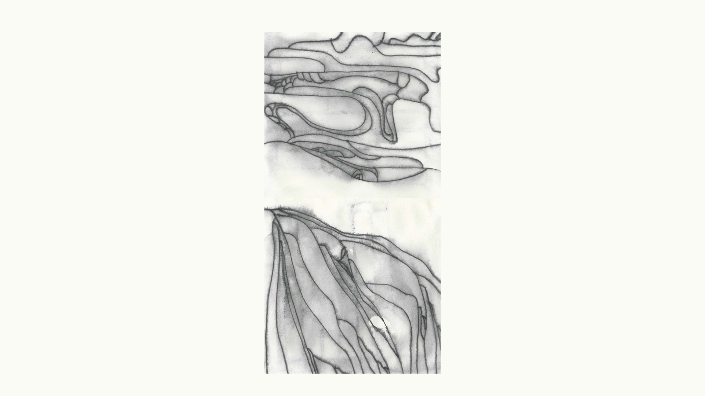
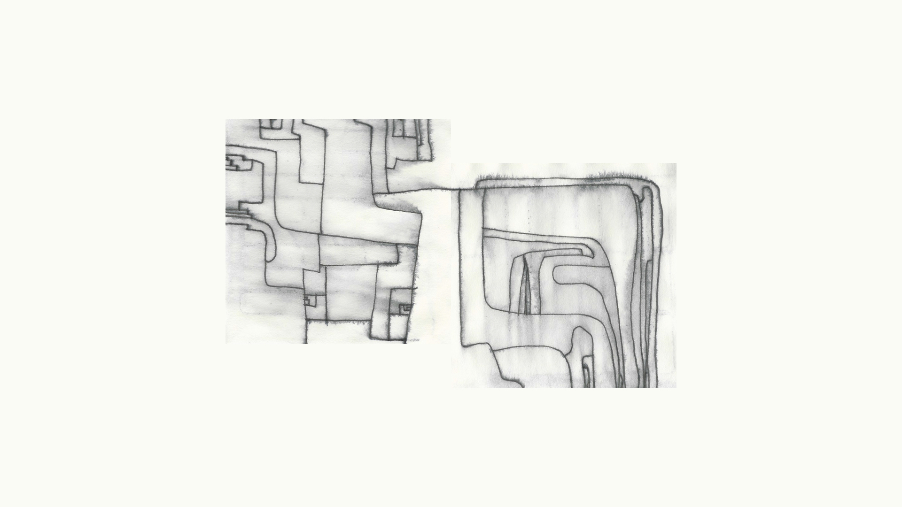
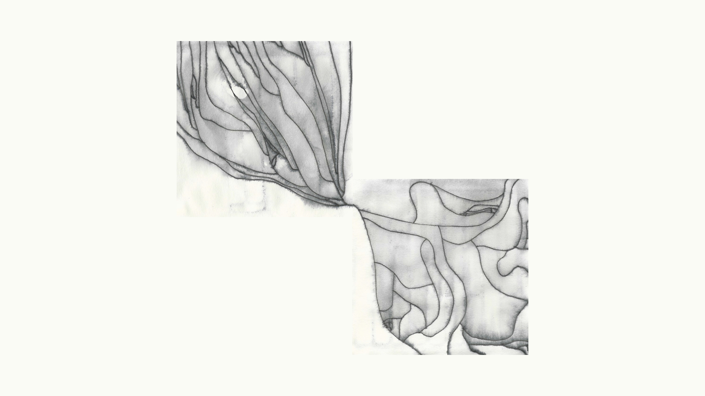
