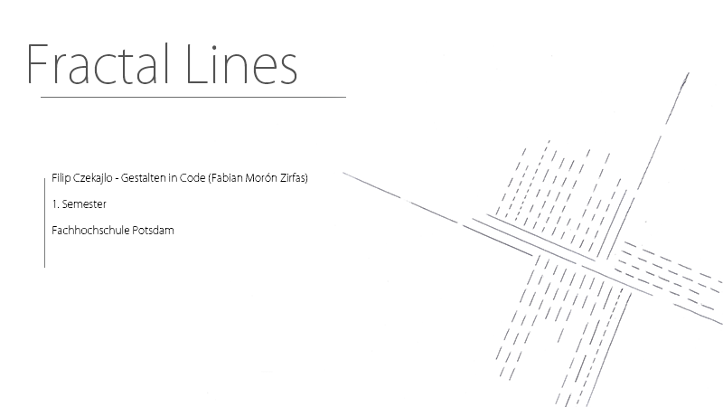

--- 
authors: 
  - "Filip Czekajlo"
authors-url: 
  - "https://github.com/filipczekajlo"
layout: Project
title: "Fractal-Lines"
type: Project
authors:
  - "Filip Czekajlo"  
---

## The Task

The Task is to create an algorithm in german which is executed by humans and outputs generative art. The goal is to get aesthetic and similar results from different participants.

## First Algorithm

The first algorithm is very simple. It barely consists of NUMBER!!!! rules

* only straight, non touching lines

Given those simple rules, the results don't look as promising.

## Second Algorithm

The second algorithm is a little bit more advanced. It goes as follows:

* At least 15 only straight, non touching lines
* Lines must be diagonal
* At least five must have regular ocurring spaces
* Same distance to each other (vertical and horizontal)

The results are much more consistent in this one then in the first. They all follow the same rules, yet they all look different to each other. Even though there is a huge step up from the first attempt there is still room for improvement. Since there are no hardware requirements given, most participants don't use a ruler thus leading to an untidy result. There also needs to be more experimentation done. 

## Third Algorithm

The third algorithm uses the same basic rules as the previous ones but it also adresses their problems by setting hardware requirements and using colors to get different results.

* At least 15 only straight, non touching lines
* Lines must be diagonal
* At least five must have regular ocurring spaces
* Same distance to each other (vertical and horizontal)

[here](https://postimg.org/gallery/if0is1lq/)
