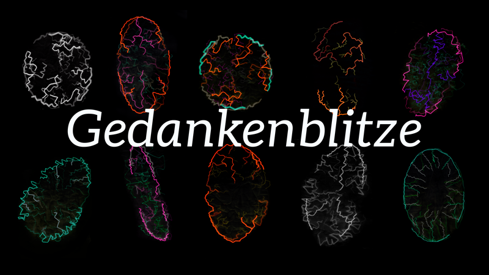

--- 
authors: 
  - "Julian Broocks"
authors-url: 
  - "https://github.com/hulianbrox"
layout: project
title: "Gedankenblitze"
type: project
---

## The assignment

The assignment was to create an algorithm that had to be sketched on paper by 10 test persons. Content of the algorithm was a simple drawing instruction after defining parameters like tools, format, time and material. The description should be precise and easy to execute while leaving room for free interpretation. Further on, more iterations were conducted by changing parameters of the algorithm to improve its description and output. 

„Analog algorithm“ was the first assignment of »Designing with code – the basic of generative design« by Fabian Morón Zirfas at the University of Applied Sciences Potsdam.

## My inspiration 
Inspiration came from the shapes of lightning, which can be recreated with paper by crumpling it, and from an artwork by Anders Hoff, who published a study of generative algorithms. The centralized arrangement of the elements in the picture were really appealing. So this aspect was implemented into the algorithm. 

  
[source](http://inconvergent.net/"inconvergent") 

## The algorithm 

### Material and tools 
a white piece of paper: »background layer« 
a tracing paper: »drawing layer« 
tools: 3 pens of different thickness

### Background layer 
Thick pen: Draw an oval or circle which is almost as big as the drawing surface. This is your auxiliary line. Divide this line in 2 - 4 parts. There are gaps between these parts which are as wide as 2 - 5 fingers. 

### On the tracing paper 
Crumple the paper and flatten it again. Put it on top of the background layer. 

> Now trace the rigid lines which came from crumpling the paper.  
> Thick Pen: Trace the rigid lines along the auxiliary line.   
> Medium-size pen: Draw one to three branches from each line into the centre of the oval/circle.  
> Thin pen: Repeat the previous step one to two times. 

### Digitalising 
The two papers are scanned and colours are reverted.

## First iterations 

Part of the initial algorithm were lines, which originated from one point on the paper and along which the test persons were supposed to draw triangles. Playing around with the algorithm by changing the following parameters:
<ul>
<li>material like aluminium, toilet paper, oranges</li>
<li>shape of the drawing surface like circle and triangle</li>
<li>size, style and amount of triangles on the line </li>
<li> circles instead of triangles</li>
<li>colors</li>
</ul>

It was very important two conduct more iterations. First of all to improve the description of the algorithm to avoid misunderstandings and to improve the output. At this stage this was my favourite : 

## Final algorithm 
Based on the feedback the next step was to get rid of the triangles and to focus only on the lightning-style lines. Two very dominate shapes were too much and reducing the noise made the output look much more harmonious. The new algorithm reminded one of planets or a visualisation of the brain. That’s why the desicion was made to invert colours to give room for these kind of interpretations. 
 

- - - 
## License (MIT) 

(c) 2017 Julian Broocks, University of Applied Sciences Potsdam (Germany)

Permission is hereby granted, free of charge, to any person obtaining a copy of this software and associated documentation files (the "Software"), to deal in the Software without restriction, including without limitation the rights to use, copy, modify, merge, publish, distribute, sublicense, and/or sell copies of the Software, and to permit persons to whom the Software is furnished to do so, subject to the following conditions: The above copyright notice and this permission notice shall be included in all copies or substantial portions of the Software. THE SOFTWARE IS PROVIDED "AS IS", WITHOUT WARRANTY OF ANY KIND, EXPRESS OR IMPLIED, INCLUDING BUT NOT LIMITED TO THE WARRANTIES OF MERCHANTABILITY, FITNESS FOR A PARTICULAR PURPOSE AND NONINFRINGEMENT. IN NO EVENT SHALL THE AUTHORS OR COPYRIGHT HOLDERS BE LIABLE FOR ANY CLAIM, DAMAGES OR OTHER LIABILITY, WHETHER IN AN ACTION OF CONTRACT, TORT OR OTHERWISE, ARISING FROM, OUT OF OR IN CONNECTION WITH THE SOFTWARE OR THE USE OR OTHER DEALINGS IN THE SOFTWARE.

See also http://www.opensource.org/licenses/mit-license.php
