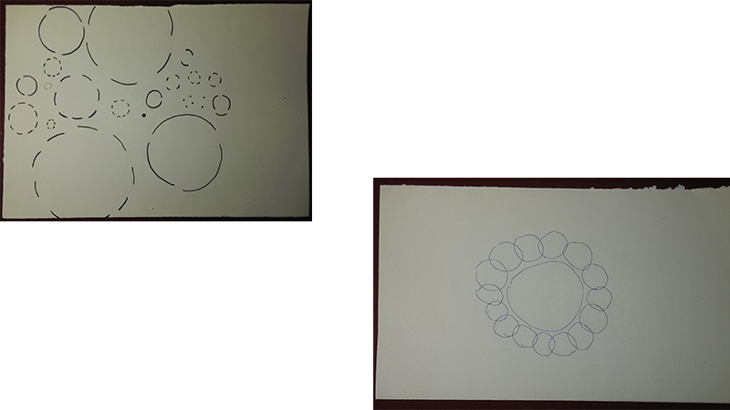
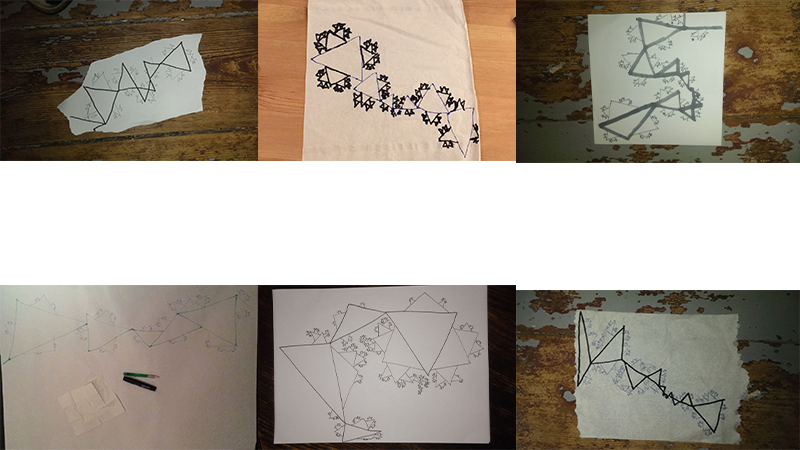
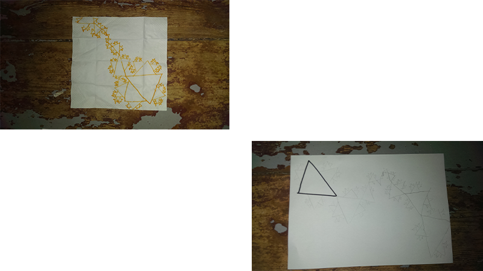
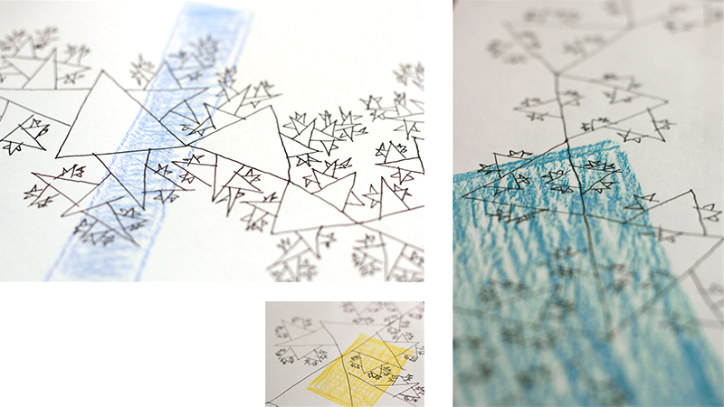

--- 
authors: 
  - "Jakob von Kietzell"
authors-url: 
  - "https://github.com/jakobvk"
layout: project
title: Interlinked Intricate Network
type: project
---

# Interlinked Intricate Network

## Analog Algorithms
 
For this project an algorithm was developed that can be executed by humans – in other words: analog. The function pattern was repeatedly evaluated and optimized iteratively.
 
The project was developed for the class “Gestalten in Code – Die Grundlagen Generativer Gestaltung” by Fabian Morón Zirfas at the University of Applied Sciences Potsdam, Faculty of Design.
 
## First Algorithm

The first algorithm was only allowed to be up to 5 sentences long and created in 5 minutes. 
These were the results. 

>Draw a circle in the center of your sheet of paper. This circle is surrounded by further circles in same distances that are evenly subdivided into pieces. There’s no gap at the same line in the circle that is further away from the centre. 
 

 

## New Algorithm

### Inspiration
The first algorithm was very open and a little hard to read, because of the messy handwriting in a hurry. The results didn’t meet my expectations at all and were very different to one another so I decided to start all over. 
 
The new thought was to have two separated areas on one work surface. In these areas there are three mushroom-like, recursive, smaller and smaller objects each. An undefined open shape crossed by lines, that are defined by objects, so that the two areas are connected will be created. The source for this thought was a conversation about fractals. The output of the algorithm should be some object that consists of lots of smaller copies of itself. 

**Fractals**
A fractal is a never-ending pattern. Fractals are infinitely complex patterns that are self-similar across different scales. They are created by repeating a simple process over and over in an ongoing feedback loop. Driven by recursion, fractals are images of dynamic systems – the pictures of Chaos. Geometrically, they exist in between our familiar dimensions. Fractal patterns are extremely familiar, since nature is full of fractals. For instance: trees, rivers, coastlines, mountains, clouds, seashells, hurricanes, etc. Abstract fractals – such as the Mandelbrot Set – can be generated by a computer calculating a simple equation over and over.

[Source: Website Fractal Foundation](http://fractalfoundation.org/resources/what-are-fractals/)
 

### execution

The people taking part only got the sheet of paper with the description of the algorithm, no additional tools or materials. The first step of the algorithm asks them to get the relevant material, needed for executing the code, so that the materials picked are comparable but not the same for all the people.  
 
>   **You need:**
>* three text/ painting tools 
>   1. thick and dark
>   2. less thick and dark than 1.
>   3. less thick and dark than 2.
>
>* One work surfaces DIN A4 or bigger
>
>**algorithm**
>1. Subdivide your work surface into three parts, so that each part got at least two >connections to the edge of the work surface.
>2. Mark the two of them that are not connected with text/ painting tool no. 1
>3. Draw three triangles with text/ painting tool no. 3 within these areas
>4. Read the following step completely before executing.
>5. Draw another triangle in the middle of each side, outside of the triangles 
>6. The sides of the new triangles are smaller than the side of the triangle you attached them
>7. One of the sides of the new triangles is a part of the side of the triangle it is attached to (The new triangle is attached outside of the old triangle)
>8. On the same principle draw further triangles at the sides of the triangle from step 5 that are lying freely. 
>9. Repeat this for all the new triangles until the new triangles are smaller than the stroke width of your text/ paint tool.
>10. Read the following step completely before executing
>11. Draw straight lines with text/ paint tool no 2., that are each on the one hand side connected with the corners of the triangles drawn in step 3 and on the other hand side with the free corner of the triangle drawn in step 3 facing the other one.
>12. Continue drawing the lines until you reach the edge of the work surface.

 
### constant parameters
 
One work surface 
Three areas 
Each connected twice with the edge of the work surface 
Three triangles that are branched out recursively 
18 lines  
 
### variable parameters
 
All of the other parameters were to a certain extent interpretable, partly as well to be able to execute the algorithm with only a few devices. Especially the size of the work surface and how it was subdivided was interesting for me. 
 
### evaluation
#### What went wrong? What worked out?
 
When defining the algorithm it was hard to unequivocally define and still leave space for interpretation. 
The algorithm was too long and too complicated to execute. The people taking part didn’t enjoy.  
The expression “two connections to the edge of the work surface” wasn’t unequivocal. The additional information that two areas should not touch would have been enough. 

But there always are two seperated areas with three branched out objects, that mostly are connected with the other areas.

 
  

## 1st iteration

>**material** 
>work surface: sheet of paper bigger than DIN A4 or a tissue 
>pen1: a thick pen 
>pen 2: a thin pen 
> 
>One. 
>Draw a triangle with a size of about an eighth of your work surface with pen 1. Draw one triangle each on the outside of the sides of the triangle with pen 2. Continue this with pen 2 for all the triangles you’re drawing until the stroke width is too big.
>
>Two. 
>Draw another triangle with half of the size of your first triangle of step one at the corner of this triangle. Repeat step one for this triangle.
>
>Three.  
>Repeat step two for the triangle with half of the size of the first triangle and continue until the stroke width is too big.
>
>Four. 
>Draw a triangle at the corner of the triangle you drew last with double the size of that triangle. Repeat step one.
>
>Five. 
>Repeat step four until you reach the edge of your work surface. 

 
### constant parameters
 
One work surface 
A chain of triangles with recursively smaller and smaller triangles on the sides.
 
### variable parameters
 
All of the other parameters were still to a certain extent interpretable.

### evaluation

In this iteration the algorithm got rid of the three areas and focussed on the recursive triangles. 

#### What went wrong? What worked out?
 
The algorithm was still long and too complicated to execute. It took people taking part long and they didn’t enjoy.  
Although it took people long, every output is comparable and I already really liked the looks. 
 
  

## 2nd iteration

To shorten the algorithm in this iteration there is no numbered tasks. The people taking part only got the text.  

>Draw a triangle with a size of approx. an eighth of your work surface. This is your base triangle. Draw triangles outside on the sides of the base triangle and continue doing that for all the new triangles until the stroke width is too big. Draw a triangle at one corner of the base triangle, that is smaller than it and now do the same as you did with the base triangle. Continue drawing triangles on the corners until your base triangle is too small. Then continue with bigger and bigger base triangles.

### evaluation

Although the algorithm was shorter it was more difficult to understand. Two people didn't continue. The other outputs are not what I expected. 

 

## 3rd iteration

>Before executing the code, please fully read it. 

* Draw [n] equilateral triangles in different sizes. (n>5)
* Two corners of these triangles each are connected to each one corner of one other triangle.
* On every side of a triangle, there is another triangle. On each of the sides of that triangle there is another one. etc.. 
* Use 60-80% of the work surface
* Draw a rectangle filled with a colour that fits to your mood on top of the area that you like most. 

### constant parameters
 
One work surface 
A chain of triangles with recursively smaller and smaller triangles on the sides.  
At least 6 triangles 
60-80% of the work surface is filled 
A colourful rectangle 
 
### variable parameters

Open how many triangles in the end  
Open how the work surface is filled  
Open what pens and colour is chosen  
Open where the rectangle is put  

## evaluation 
 

 

<h2>License (MIT)</h2> 

(c) 2017 Jakob von Kietzell, University of Applied Sciences Potsdam (Germany)

Permission is hereby granted, free of charge, to any person obtaining a copy of this software and associated documentation files (the "Software"), to deal in the Software without restriction, including without limitation the rights to use, copy, modify, merge, publish, distribute, sublicense, and/or sell copies of the Software, and to permit persons to whom the Software is furnished to do so, subject to the following conditions: The above copyright notice and this permission notice shall be included in all copies or substantial portions of the Software. THE SOFTWARE IS PROVIDED "AS IS", WITHOUT WARRANTY OF ANY KIND, EXPRESS OR IMPLIED, INCLUDING BUT NOT LIMITED TO THE WARRANTIES OF MERCHANTABILITY, FITNESS FOR A PARTICULAR PURPOSE AND NONINFRINGEMENT. IN NO EVENT SHALL THE AUTHORS OR COPYRIGHT HOLDERS BE LIABLE FOR ANY CLAIM, DAMAGES OR OTHER LIABILITY, WHETHER IN AN ACTION OF CONTRACT, TORT OR OTHERWISE, ARISING FROM, OUT OF OR IN CONNECTION WITH THE SOFTWARE OR THE USE OR OTHER DEALINGS IN THE SOFTWARE.

See also http://www.opensource.org/licenses/mit-license.php

 
 
 

