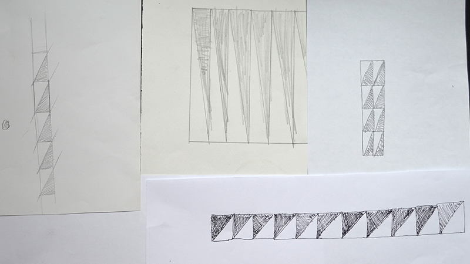
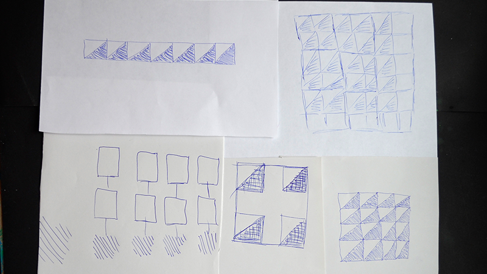
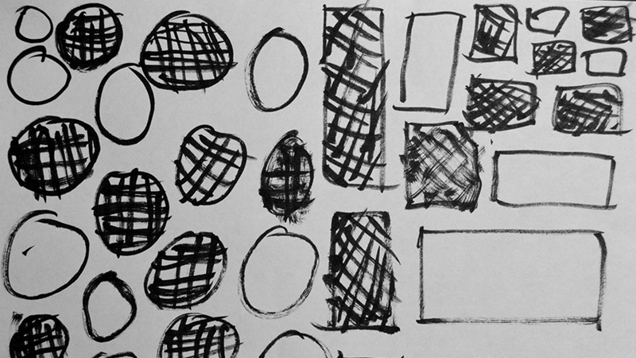

--- 
authors: 
  - "Paulina Mrksic"
authors-url: 
  - "https://github.com/paulinalinaa"
layout: project
title: "Spiral Chaos"
type: project
---



## First Algorithm
This course had started with a practical part in which the task was to think about how to write a good set of rules.

### Inspiration

The Inspiration for the set of rules was a pattern which I had sketched some years ago. It was black and white and very geometrical. After some thoughts the idea was a bit modified and the set of rules was done. It was important to make the set of rules as short and also as simple as possible.

### This was my set of rules

>Draw a rectangle (not too broadly) and draw from the upper left corner down to the bottom right corner a diagonal line. Paint the right triangle and repeat this endlessly. While you line up the rectangles. The pencil makes no difference.

### Result

After 5 flows with our fellow students we have had a small presentation in which we have briefly read out our set of rules and have given then a conclusion to the result. Moreover, we should choose our favourite and reason this.
Sometimes were tips given to the better understanding and criticism were expressed.





### 1. 1 Reworking algorithm 
**Task**
- Rework the algorithm or sketch a new one. Let them draw from at least 10 people.

With the second attempt I have written down the sentences in key points and have tried that all quadrangles have the same size and are lined up side by side. I wanted to be able to compare the results even better and have limited the format to A5.

### Set of rules

>Firstly read through everything
>draw a quadrangle (not too big)
>draw a line from the upper left corner down to the bottom right corner
>hatch the right half
>repeat this down and on the right in each case 4x in the same size of the first quadrangle
>connect that anew resulted quadrangles with each other





### 1.2 Postprocessing - Ordered Chaos
**Task**
- Identify the parameters and the constants
- Allow carrying out reworking of the algorithm after feedback and this again by 10 people
- Change of the parameters per person and identifies like itself the result changed
- Find an exciting name for your project
- Determine material and bring the originals to the presentation

### Examples of the new set of rules



>Draw a small circle in the middle of the sheet. Draw circles in arbitrarily sizes all around without touching the other circles. Repeat this a few more times. Draw then many small circles in the space between the others and paint them completely.



>Draw a triangle. Draw besides another one. Draw under, beside and above the triangles many new ones. Halve all resulted triangles in the middle and hatch the right half.



>Draw in the left corner only circles. Firstly small and then greater and greater without touching each other. Draw in the right corner only quadrangles. Again only small and then greater and greater without touching. Do that until the sheet is full and hatch randomly some circles and quadrangles. 



>Add different forms side by side, so that they touch and overlap each other. Paint the overlapping.



>Draw from the middle of the sheet a spiral about the whole sheet. Draw randomly distributed circles, quadrangles and triangles all over the sheet. Hatch this in the end. 

At the end of this task I have noticed that extremely different results have come out and the most exciting one was for me with the spiral. I have completely removed from my set of rules from the beginning, but sometimes you get through doing things great results.

### 1. 3 Postprocessing - Spiral Chaos
**Task**
- Rework the set of rules after other feedback
- No Step-by-Step instructions, formulate a right set of rules
- A connected series should be the result
- Reproduction can be a part of the result (different cuttings)

### Set of rules

>Draw in the standing position from the middle of the sheet a spiral about the whole sheet without removing the pencil. Draw randomly distributed circles on the sheet which the spiral cuts and paints the forms in the end.



### 1.4 Conclusion
Funnily much of the people had fear of the white sheet of paper, so I gave them as a tip to close their eyes.
Because I have worked with Indian ink and some colour, every test person has drawn a spiral and afterwards they had got from me another sheet for the rest of the set of rules.
The colour blue was in comparison to the other tested the best on.
On the whole it was a pleasure and the results look also great so I think that many nice things have come out.



---

# License (MIT)
*© 2017 | Paulina Mrksic | Fh Potsdam - University of applied sciences | Grundlagen Generative Gestaltung | Fabian Morón Zirfas*

Permission is hereby granted, free of charge, to any person obtaining a copy of this software and associated documentation files (the "Software"), to deal in the Software without restriction, including without limitation the rights to use, copy, modify, merge, publish, distribute, sublicense, and/or sell copies of the Software, and to permit persons to whom the Software is furnished to do so, subject to the following conditions: The above copyright notice and this permission notice shall be included in all copies or substantial portions of the Software.

THE SOFTWARE IS PROVIDED "AS IS", WITHOUT WARRANTY OF ANY KIND, EXPRESS OR IMPLIED, INCLUDING BUT NOT LIMITED TO THE WARRANTIES OF MERCHANTABILITY, FITNESS FOR A PARTICULAR PURPOSE AND NONINFRINGEMENT. IN NO EVENT SHALL THE AUTHORS OR COPYRIGHT HOLDERS BE LIABLE FOR ANY CLAIM, DAMAGES OR OTHER LIABILITY, WHETHER IN AN ACTION OF CONTRACT, TORT OR OTHERWISE, ARISING FROM, OUT OF OR IN CONNECTION WITH THE SOFTWARE OR THE USE OR OTHER DEALINGS IN THE SOFTWARE.

See also http://www.opensource.org/licenses/mit-license.php

