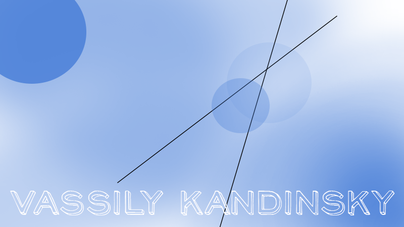
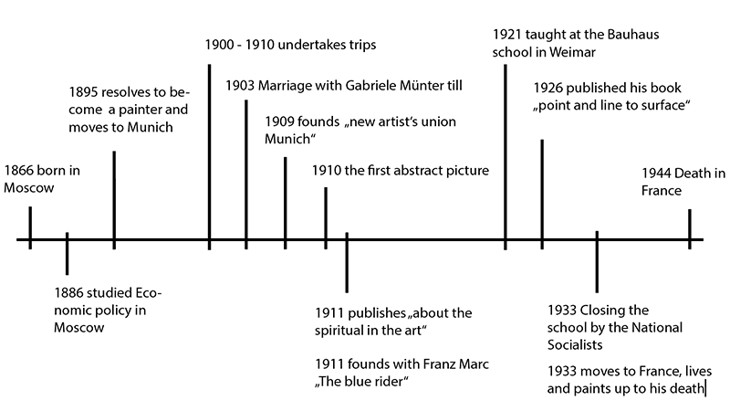
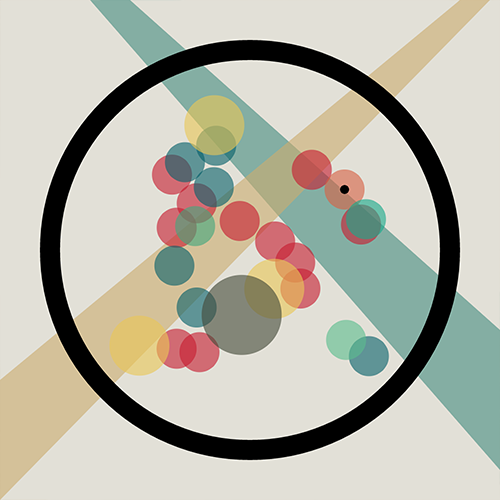

--- 
authors: 
  - "Paulina Mrksic"
authors-url: 
  - "https://github.com/paulinalinaa"
layout: project
title: "Vassily Kandinsky - Circles in a Circle"
type: project
---



## Part 1 - Task 
- In groups of two we should decide us for an artist / designer. 
- We should decide either on a work (deeply) or on a series (broadly). 
- For the presentation we should do a short summary of the elected person. 

## Biography
This project is about Vassily Kandinsky and one of his artwork - **Circles in a Circle**. Within this course we visited the Bauhaus archive in Berlin whereby my decision was decisively influenced.



**Vassily Kandinsky** was a russian painter and is known and famous as one of the pioneers of the abstract painting and the abstract expressionism. 
By his pictures and theoretical works he exerted a big influence on the development of the modern art. 

In **1866** Kandinsky was born in Moscow and he learned to play the piano and cello in early years. 
The music had played a big role in his art and life. 
**1886** he studied economic policy in Moscow where he worked as a lecturer at the university. 
After he visited a French impressionistic art exhibition in **1895** he moved to Munich and had learned the basic technologies of the painting. 

He studied the impressionistic style as well as the jugendstil. Especially he discussed with the works from Franz of Stucks. 

He painted his first pictures mainly in the impressionistic style, however, his painting style changed soon to the *abstraction*. His interest in *fantastic motives* is expressed in this time clearly in his pictures. With the painting styles which Kandinsky had got to know in Munich he was increasingly discontented. They looked expressionless on him and dull. 

In **1900 till 1910** he traveled a lot. He had visited Paris where he had got in touch with Paul Gauguin and through him with the neoexpressionism (the Fauvismus). 
Also he traveled to Germany and founded the artist's group *Phalanx*. He had got to know the expressionist artist *Gabriele Münter* and married her a short time later. This marriage holds till **1916**. 
In **1909** he traveled to Munich and founded the *new artist's union Munich*. In **1910** he had painted his first abstract picture with watercolors. 
A year later he painted the picture - composition of V.

Still in the same year this picture is rejected by the jury of the *new artist's union* for an exhibition. The judgment of the jury is: too abstract. 
As a result from it Kandinsky leaves his own founded artist's group together with Franz Marc, Gabriele Münter and Alfred Kubin. 

In **1911** he and Franz Marc had founded *The blue rider* and organised international avant-garde exhibitions in Munich. They develop to the most important exhibitions of the German expressionists.

During the **First World War** he lived in Russia where he had taught and organised other art exhibitions. 
In **1921** he returned to Germany and started to taught at the Bauhaus school in Weimar. 
Kandinsky published in **1926** his work *'point and line to plane'*. In it he propagates for an abstract *absolute* painting art. This work becomes an other important basis for the creative process within the abstract art. 
His time ends there in **1933** with the closing of the school by the National Socialists. 

After the Bauhaus period Kandinsky moves to France. There he lives and paints up to his death in **1944** in a Paris suburb. He had become a member of the Parisians artist's group Abstraction-Création. From the National Socialists Kandinskys pictures were devaluated, like from many other artists in this time, they had become *degenerated art*. Many of his pictures are exiled in **1937** from the German museums.

## Inspiration
**'Point and line to plane'** 
In this varied work he describes the psychological effects of the colour and the resemblances between painting and music. This book had become a fundamental importance for the abstract painting. In the most important chapter 'Forms and colour language' he develops his theory that form can exist in contrast to colour independently. 
That means that the form influences the colour substantially. 
 
This work had woken up immediately my interest. They are so simple and as well so appropriate, although it concerns things which are rather unconsciously and true. 

For example, he describes the **point** as such in the everyday use. How his primary meaning, in an assembly-line text, is taken from him and no one perceives the point anymore as a circle. 

Then he describes **music instruments** with colours, for example is yellow a trumpet. In the beginning the trumpet is stimulating and nice, however, the longer you listen to her play, the more aggressively and more unbearably becomes the sound. 
This attribute, of the sound and the glare, fits perfectly to the sharp triangle. 
In the beginning **this book** was my basis, nevertheless, finally I have decided to take a certain work for the analysis (deeply). It is the painting *Circles in a Circle* of 1923. This was one of his first paintings in which he had occupied only with the circle.

## Part 2 - Task
- Analyse the artist after categories and gestalt laws. 
- Besides, we should sketch methodologies and tools for the analysis.
- According to the analysis we should formulate a set of rules and apply it in code.
 
## Analysis - Circles in a Circle 1923

[Link to the picture](http://www.wassilykandinsky.net/work-247.php) 

*"The contents of a piece of art are the sum of his tensions."*

In a letter from 1931 Kandinsky wrote about the picture Circles in a Circle: „It is the first picture of me which places special emphasis on the subject of the circles.“ He describes many aspects and rules about paintings in his book *'point and line to plane'*.

For example, the **format** plays an important role, because it influences the picture in his decisively effect. In this painting he has used a square form what is coldly and warmly at the same time, the tensions in the picture are relatively compensated.

*Primarily the picture exists out of circles, but which meanings had them for Vassily? In his view the circle had a cosmic meaning, it is the uncoloured quiet and the result of two always steadily working forces.*
Therefore the circle does not know the forcible of the angle and the most central point is the most perfect quiet of the not anymore isolated point.

The **big black circle** in the middle of the picture works like the second frame of the picture, this would be the gestalt law of the Conciseness and the contrast.
This gigantic circle encourages us to concentrate us upon the internal interaction.

Kandinsky has spoken a lot of **tensions** in the picture. They could be formed from a direction, an angle or from the colour themselves. 

In this work he has used two sharp **diagonal lines**. From the bottom left to the top right corner which loses tension according to his rules because the line touches the basic form (edge). Nevertheless, this direction course looks rather harmonious. He selected the colour yellow which inner meaning is rather garish.

The second **diagonal line** runs from the bottom right to the top left corner this loses tension by the touch of the basic form (edge) like the other one. This direction looks unharmonious and he chose a mixture from green and blue, it's a quiet colour. 
Vassily generates by these both cutting diagonal lines a perspective and shifted the focus point through the crossroads into the circle, this is the gestalt law of space through colour.

Within his work there are 26 overlapping **circles** in different sizes and colours. The gestalt laws are of proximity, of similarity and the connected elements. It has 12 red, darkly violet till orange, circles which appears passive. Moreover, a red circle has a black small circle as the centre and three red circles are bordered. 
There are also three yellow circles which appears more active and two of them are very big.
Then there are another six light blue to deep blue circles.
The deeper the blue is the more it calls the viewer into the infinite and awakes in him the longing for the pure and the extrasensory. 
A blue tone which sinks more to black gets an overtone of a not human grief, that is the theory of him. 
There are another three green and a grey circle in the painting. 

Inside of the big circle there run 12 short and 15 long randomly distributed **lines** with different widths and angles with the result that they cut the single circles.
 
Generally Vassily has spoken in his book of warm and cold forms. The vertical ones are the warm forms and the horizontal ones are the cold forms. The internal sound (warmly / coldly) of a diagonal lines determines the angle. 
The single colours, be it those of the circles or the diagonal lines in the background, are  added through the overlapping, so that the colours are mixed with each other. This is the gestalt law of the space through overlapping.

## Set of rules 

1. Background yellow / white 
2. two coloured diagonal lines
3. big black outlined circle, in the middle of the picture 

within the circle 

4. 26 circles = 12 red (1 with inner circle), 6 blue, 3 yellow, 3 greens, 1 grey  
5. overlapping = addition of both colours 
6. 12 short and 15 long randomly distributed lines

## Code Result


###### [Source](http://lokeshdhakar.com/projects/color-thief/) 



Here is the [Link](https://github.com/paulinalinaa/vassily-kandinsky-circles-in-a-circle) of this code.

- - -

# License (MIT)
*© 2017 | Paulina Mrksic | Fh Potsdam - University of applied sciences | Grundlagen Generative Gestaltung | Fabian Morón Zirfas*

Permission is hereby granted, free of charge, to any person obtaining a copy of this software and associated documentation files (the "Software"), to deal in the Software without restriction, including without limitation the rights to use, copy, modify, merge, publish, distribute, sublicense, and/or sell copies of the Software, and to permit persons to whom the Software is furnished to do so, subject to the following conditions: The above copyright notice and this permission notice shall be included in all copies or substantial portions of the Software.

THE SOFTWARE IS PROVIDED "AS IS", WITHOUT WARRANTY OF ANY KIND, EXPRESS OR IMPLIED, INCLUDING BUT NOT LIMITED TO THE WARRANTIES OF MERCHANTABILITY, FITNESS FOR A PARTICULAR PURPOSE AND NONINFRINGEMENT. IN NO EVENT SHALL THE AUTHORS OR COPYRIGHT HOLDERS BE LIABLE FOR ANY CLAIM, DAMAGES OR OTHER LIABILITY, WHETHER IN AN ACTION OF CONTRACT, TORT OR OTHERWISE, ARISING FROM, OUT OF OR IN CONNECTION WITH THE SOFTWARE OR THE USE OR OTHER DEALINGS IN THE SOFTWARE.

See also http://www.opensource.org/licenses/mit-license.php

